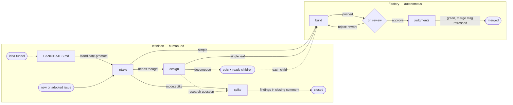

# Software-factory cleanup — working plan

Working memory for branch `2026-07-30-software-factory-cleanup`. Re-read after any `/clear` or compaction to restore state. Each unit closes with the orchestrator updating this file: decisions in, questions out, the completed unit deleted — finished work is simply the codebase's current state. Not a deliverable — delete before merge (root `PLAN.md` is lint-excluded as transient).

## Context

- One branch, one PR; everything rolls in here. Issues #276 and #273 are subsumed below (U4, U6) — they close when this PR lands.
- Prior landed work is in `git log`; notably `107c920` already made the reviewers judgment-blind and the overwatch brief in the terminal.

## Operating model

Two terminals, side by side. This file is the sole handoff artifact: any fresh session, either side, must be able to resume from it alone.

- **The orchestrator (Fable).** Runs the design sessions with the user, sharpens each unit's brief here before launch, keeps this file current, delegates deep dives to Opus/Sonnet subagents (naming the model tier per dispatch), and never executes units itself. `/clear` between sessions; this file restores state.
- **One active implementation session (Opus).** Executes the last briefed-and-aligned unit. Launch prompt, pasted fresh per unit (one line):

  `Confirm you are in the worktree ~/workspace/dev-playbook/.claude/worktrees/2026-07-30-software-factory-cleanup on branch 2026-07-30-software-factory-cleanup — if not, enter it with the EnterWorktree tool (path=.claude/worktrees/2026-07-30-software-factory-cleanup). Then read PLAN.md at its root and execute the next unchecked unit exactly as briefed. I am present — ask me the moment intent is ambiguous; never improvise. PLAN.md belongs to the orchestrator session: never edit it, and ignore changes appearing in it mid-run. When done, report and stop before committing; when I invoke /commit, stage every file of your unit's work but never PLAN.md.`

- **The user is in the loop throughout** — this is not the factory and nothing is AFK. Execution sessions ask the user on the spot instead of improvising; the user reviews each unit's diff in VS Code and says when to commit (one commit per unit, so the PR reads unit-by-unit).
- **Both sessions share this one worktree and branch, split by file ownership.** The orchestrator owns PLAN.md exclusively — it ticks units and records outcomes from the implementer's report; the implementer owns every other changed file and never edits PLAN.md. For the orchestrator: don't edit factory files while a unit is in flight; the implementer's work-in-progress in `git status` is expected, not an anomaly. For the implementer: uncommitted PLAN.md changes in the tree are the orchestrator's — leave them unstaged at /commit; and the PLAN.md on disk may carry fresher briefs than your launch context — the disk wins.
- Runtime skills are stowed from the **main checkout**, so nothing edited in this worktree changes live behavior until merge; main's review skills stay usable on this PR at the end.

## End goals

1. **Three pauses** in the review/rework stretch (post-implementation only):
   - **Pause 1 — review verdicts during rework cycles.** Overwatch escalates minimally, assuming no reader knowledge of code/docs/PR/comments. Brief format, four parts: *current state, goal, proposed new state, specific example*. The user exists only in the terminal chat.
   - **Pause 2 — judgments, conditional.** After review approves, the overwatch runs the judgments node as preparation for the final read. It pauses only when a failure's fix is ambiguous enough to want human advice; a clean green run pauses nothing.
   - **Pause 3 — final PR review.** The human reads the entire final diff and decides the merge. Presented 100% done: judgments green, merge message refreshed, verified push handed over, closing brief. Nothing left but the read and the merge.
2. **Dedicated judgments node** at the end, after all review/rework cycles — judgments are expensive, slow, false-alarm-prone; keep attention off them during normal cycles.
3. **software-factory.md split** into sub-files (currently a 227-line monolith).
4. **Skills re-evaluated from scratch**, plus dedup into shared reference files with progressive disclosure.
5. **Intake and design move outside the factory** — pre-factory intent extraction producing a factory-ready issue.
6. **SDD stripped** (ratified 2026-07-30) — the factory does not support SDD for now; labels stay in the data, and the factory halts on any SDD-labeled issue.

## Decisions so far

- Pause scope = the review/rework stretch only (three pauses; see End goals).
- Intake + design: pre-factory.
- **SDD strip (ratified 2026-07-30, supersedes the earlier freeze):** SDD is removed from the factory's graph, docs, and skills — a temporary simplification; SDD returns later. All label values (`mode:sdd`, `phase:sdd-*`) stay in the data untouched, as do bootstrap-labels and all code; the factory halts immediately on encountering an SDD-labeled issue. The SDD build-layer mechanism is out of scope (spec-tools uses it live).
- **U2 — build/tdd merge (ratified 2026-07-30):** one `build` node, one `/build` skill. `tests:*` becomes pure data the build skill reads: `tests:yes` is a hard progressive-disclosure gate — load the TDD reference (red-green, test-first discipline) before any file edit; `tests:no` skips it. `/tdd` is deleted; its discipline text becomes build's reference. `phase:tdd` leaves the scheme. **Migration:** relabel open `phase:tdd` issues to `phase:build` in place across governed repos before consumers re-run bootstrap-labels (closed-world deletion would strip them otherwise) — lands in U7 closeout + PR consumer notes.
- **U2 — spike (ratified 2026-07-30, supersedes both prior spike rulings):** spike is a graph node in the definition region, and a spike issue always carries `phase:spike` — node ⇒ label, uniform with the parity invariant; ordinary lint coverage (brief shape, `spike⇒tests:no`) applies.
- **U2 — graph/scheme parity invariant (wording by example):** the graph's work nodes, `_`→`-` and `phase:`-prefixed, must equal the scheme's phase values exactly — inventory: `intake, design, spike, build, pr-review, judgments`. Exempt: pre-issue states (`CANDIDATES.md`, the idea funnel — no issue, no label), terminal endpoints (merged, closed), and the four `phase:sdd-*` values the halt rule names. A scheme value with no node, or a node with no value, is the violation; the `scheme-vs-graph` judgment enforces it.
- Rules live in one place — standing principle for every pass.
- **U2 — judgments node (ratified 2026-07-30):** `phase:judgments`, a real node at the traverse's end — the approve verdict at PR review advances to it; it runs *before* the final PR read, as preparation. **No wrapper skill.** The overwatch owns and runs the node inline at its own main loop, invoking `/run-judgments` there — surfaced by progressive disclosure: the endgame text re-homes from overwatch §6 into a reference file the overwatch loads only on entering the node. Hard constraint, empirically probed 2026-07-30: subagents have no Workflow tool (absent from inventory and deferred index), so this node cannot be AFK-delegated — the doc states that as the reason. Fixes are the overwatch's own, focused, committed autonomously; an ambiguous failure escalates (the conditional pause 2). No rework back-edge — a red gate parks the issue at the node; judgment fixes never reopen review. `phase:judgments` is an additive scheme change; consumers re-run bootstrap-labels.
- Push taps (YubiKey) can't be eliminated — fold the push command into the adjacent brief.
- **U1 — definition region (ratified 2026-07-30):**
  - **Partition.** The mermaid stays whole-system and expands to show the definition region — candidate → intake → design — as one subgraph, the factory as the other: **definition** (human-led, intent-heavy) vs **the factory** (autonomous; it automates implementation in the wide sense, build through review and merge). The doc keeps its name; its opening defines the two regions. Voice: describe the factory operating — no absolutes about what must enter it. The overwatch executes factory nodes only: launched on an issue whose phase sits in definition (or unlabeled), it hard-refuses and names the skill to run. Its narrow "implementation nodes" renames to "committing nodes" (U5).
  - **Labels unchanged.** `phase:intake`/`phase:design` stay in the scheme; workspace-lint's `_post_intake()` sentinel untouched; "the graph IS the phase-label inventory" re-scopes to the issue-bearing nodes (wording at U2 — candidates are pre-issue and mint nothing).
  - **Ownership split — statics vs dynamics.** The tracking standard owns homes and shapes: candidate entries, the three brief formats, native relationships, the readiness bar (defined in issues.md; the factory cites it at the crossing). software-factory.md owns states and transitions, the definition region included; the tracking card points there for lifecycle exactly as it already does for PRs.
  - **The flow.** /candidate-promote stays as-is (elevator: entry → /intake, owns lookup + delete only). **/intake = accounting + routing**: grill, pick category/mode/tests, author the brief for simple work, then either release straight to the factory's first work node or park at `phase:design`. Intake loses its slicing/epic machinery (§2) and gh wiring recipes (§6). **/design = research + decomposition**: grill-with-docs plus orchestrator-style fan-out, prototyping in a disposable worktree deleted at exit (nothing merges from definition); its exit either re-authors the single leaf's brief or converts the issue to an epic and mints ready, sliced, relationship-wired leaves — the decompose exit issues.md already describes. Decomposition rules (slice sizing, epic wiring, blocked-by order) live once in the tracking standard; both skills cite. Both skills become user-invoked — no overwatch launch.
  - **`## Approach` is dead.** Design's single-leaf deliverable is the brief itself re-authored — the thinking folds into the six build-leaf headings; no extra section, one brief contract everywhere. For decomposed work the thinking lands in the epic body's rationale and the slice briefs.
  - **Spikes are definition-region work.** A spike is a GH issue with `mode:spike`; everything it produces lands on the issue directly (findings in the closing comment, no PR), never persisting in git. It can stand alone (ad hoc) or be tied to a design effort, informing how an epic slices. Labeling superseded at U2: spike is a node and always carries `phase:spike`. The spike brief format stays in issues.md.
  - **Left edge.** The mermaid shows `CANDIDATES.md` as an entry state with the /candidate-promote edge into intake, plus one unexpanded arrow in from the idea funnel; detail stops at the repo boundary.
  - **gh recipes** get a new Guide, `standards/tracking/tracker-operations.md` (to create — it does not exist), cited by design; issues.md stays a pure shape Standard.
  - fill-issue-gaps deleted outright; /idea and mission-control's inbox/curation are out of scope entirely.
- **U2 — skill mapping (ratified 2026-07-30):** the dispatch table is factory-only — `build` (`/build`, AFK, carries the commit token, TDD reference hard-gated on `tests:yes`), `pr_review` (`/open-pr` then the review tracks, AFK audits, verdict stop = pause 1), `judgments` (no skill — the overwatch runs `/run-judgments` inline; conditional pause 2). `/intake`, `/design`, `/candidate-promote` are definition-region, user-invoked, never dispatched. The `spike` node deliberately has **no skill** — a user-run session writes findings to the issue and closes it; skill-less nodes are an escalation only inside the factory. `pr_review` stays a single diamond: track selection (code/doc/fidelity) is a rule inside the one stop.
- The user personally reviews every implementer diff before /commit — audit dispatches look for **mistakes and omissions only**, never brief-deviation reporting.

## Units — work in order

Each unit lands whole before the next starts. U4→U5 is a real dependency (overwatch cites U4's files); U6 needs only U1+U3.

**Next:** U3 — the first implementer unit; both design sessions (U1 definition region, U2 graph) are closed and fully ratified in Decisions. The SDD strip is landed in the codebase.

- [ ] **U3 — doc restructure.** Rewrite `software-factory/software-factory.md` around the ratified whole-system graph — embed the mermaid and skill table from the section below **as drawn**: two-region opening per the U1 partition, definition region states, the factory line, the parity invariant (wording in Decisions), the SDD halt rule kept. Split into sub-files under `software-factory/`: the exact layout is the implementer's proposal — put it to the user at session start before writing (expectation: a hub doc plus contract sub-files; okf-lint requires an index + frontmatter per doc). Author the pause-1 four-part escalation-brief format and the pause-3 final-presentation contract (the conditional pause-2 text is U5's, not here); one home per rule. `standards/tracking.md` card gains the lifecycle pointer per the ownership split. `label_scheme.json`: add `phase:judgments`, drop `phase:tdd` — scheme and graph move together to preserve parity; update any tests naming those values. Re-point 12 inbound files / 9 anchors (ref-lint validates anchors; okf-lint forces index entries + frontmatter); fix un-linted stale refs: `scripts/bootstrap-labels` + `label_scheme.py` docstrings cite software-factory.md, `scripts/README.md:134` claims bootstrap-labels is "auto-invoked by /intake" (false); issues.md's spike-brief section cites "software-factory.md's spike path", which the graph no longer carries — re-point to the spike's definition-region home. No consumer pin bump (doc/label/dotfiles changes don't touch the published playbook-lint hook); consumers re-run bootstrap-labels after label changes. SDD-strip residuals to sweep: `workspace_lint.py:78` guard comment is now false (claims issues.md and the headings rule "cannot disagree" — post-strip the doc heading says `mode:direct` only while the code still routes sdd); the live `mode:sdd ⇒ tests:yes` lint rule has no doc home; the skill-families bullet in `standards/claude-code/skill-conventions.md` needs a non-sdd example.
- [ ] **U4 — #276 dedup + the tdd/build merge** (design of record: issue #256 comment 5109029948; SDD skills deleted at U0). **The merge lands here:** delete `/tdd`, fold its discipline into `/build` as a TDD reference behind the `tests:yes` hard gate, per the U2 decision. Rule R1–R10 first, then three reference files flat under `software-factory/` (`review-contract.md` Standard, `pr-feedback.md` Guide, `refactor-catalogue.md` Guide opening with the new Fowler smallest-step rule), then rewrite live citers: code-pr-review, doc-pr-review, bug-pr-review (partial), and the merged build. **New absorbed-block candidate found this session:** the "Judgments are not yours" clause (added by 107c920, postdates the draft) is now ×4 across review skills → belongs in review-contract.md. R1–R10 one-liners: R1 placement dir (re-answer against the new split layout); R2 overwatch as 7th comment-surfaces citer (rec: yes, lands in U5); R3 bug-pr-review verbatim constraint (rec: partial citer); R4 deliberately-not-extracted list (rec: accept); R5 near-duplicate variations a–f need per-item rulings (sdd items moot — stripped); R6 doc-pr-review's degraded copy — extraction silently upgrades it, call out in PR body; R7 contract-wins clause — generic rule in reference, skill-local naming clause (sdd-tdd variant moot); R8 sdd-tdd drift (moot — skill deleted); R9 OKF types Standard/Guide/Guide; R10 unpinned cross-repo reads (rec: accept, existing class).
- [ ] **U5 — overwatch rewrite** + agent-view-overwatch and open-pr light touches. Encodes the three-pause structure (pause-1 verdict briefs; conditional judgments pause; pause-3 final presentation); encodes U1's refusal rule (factory nodes only — definition-phase or unlabeled issues hard-refuse); renames "implementation nodes" → "committing nodes"; runs the judgments node inline per the ratified decision (machinery unchanged: run-judgments skill → judgments-run plan/render/record CLIs → machine-local SQLite seen-set; §6's endgame text moves to a progressive-disclosure reference loaded on entering the node); cites U4's references instead of carrying the 7th comment-surfaces copy.
- [ ] **U6 — definition-region implementation** per U1's flow decision: rewrite /intake (accounting + routing; slicing/epic machinery and gh recipes out) and /design (research + decomposition; **#273 lands here** — design-it-twice parallel fan-out, cheap variant: 3–4 agents on minimize-surface / max-flexibility / common-caller / ports-and-adapters axes only when the interview flags the public surface as load-bearing, compared on depth, locality, seam placement; seam sketching before writing; decompose exit with no round-trip through intake). Home the decomposition rules and gh recipes once in the tracking standard (`tracker-operations.md` is a file to create, not cite — it does not exist yet); both skills cite it.
- [ ] **U7 — closeout.** Delete PLAN.md; full gate; the `phase:tdd` migration (relabel open `phase:tdd` issues to `phase:build` in place across governed repos, before consumers re-run bootstrap-labels); PR body notes (R6 silent upgrade; consumer actions: the relabel + bootstrap-labels rerun); final presentation per the pause-3 contract.

## Open questions

- **U4:** the R1–R10 rulings.

## The ratified whole-system graph (2026-07-30)

Dotted edges are informational; solid edges are state moves. The three crossing edges (intake's release, design's release, epic children entering) are the only factory entries.

The ratified skill table (factory dispatch; definition skills are user-invoked and never dispatched):

| Node | Skill | Engagement |
|---|---|---|
| `build` | `/build` | AFK, commit token; `tests:yes` hard-gates the TDD reference load |
| `pr_review` | `/open-pr`, then tracks: `/bug-pr-review` + fidelity, `/doc-pr-review` | AFK audits; verdict stop = pause 1 |
| `judgments` | — | inline: overwatch invokes `/run-judgments` at its main loop; conditional pause 2 |

## System map (scout digest, 2026-07-30)

- **Judgments:** declarations in `judgments/*.yaml` → content-addressed SHA-256 keys (root-invariant) → machine-local SQLite seen-set (`~/.cache/skipcache/seen.sqlite`). Pytest gate `assert_judgment_cached`; `SKIP_JUDGMENTS=1` default (visible skip); `make check-judgments` arms; canonical pre-push hook runs it; `--no-verify` skips it (the factory's intermediary pushes). Only /run-judgments (main loop, scatter-gather Workflow) fills the cache. Docs: `standards/judgments/*`, `standards/semantic-validation.md`.
- **Automation surface:** ref-lint validates `~/workspace` citations incl. `#fragment` anchors against GitHub-style heading slugs (skills are rootless → Citation form correct there; fixed-root docs must use Links). okf-lint: index freshness + frontmatter `type`. skill-lint: frontmatter, name=dir, model/effort enums, references/ one level deep, dotfiles symlink mirror. standards-lint: card cells; rule-matrix ties `standards/software-factory.md`'s Audit cell to workspace-lint's emitted rule ids. workspace-lint hardcodes: `_post_intake()` sentinel, `mode:sdd⇒tests:yes` / `spike⇒tests:no` pairings, BUILD/SPIKE_HEADINGS mirroring issues.md. Single published hook (playbook-lint); pin bump only if detector logic changes — none planned.
- **SDD blast radius:** two independent layers — the factory layer (the strip target) and the build-layer mechanism (`Makefile.sdd`, repo-lint `Layers.sdd`, standards/build docs) — the latter out of bounds; spec-tools uses it live.
- **Front door:** 43 couplings cataloged (Opus scout, in transcript); the real-decision subset is in U1 above; the rest are mechanical renames.

## Key files

- `software-factory/software-factory.md` + `skill-authoring.md` — docs under refactor.
- `dotfiles/dot-claude/skills/` — issue-overwatch, tdd, build, open-pr, {bug,code,doc}-pr-review, intake, design, run-judgments, agent-view-overwatch.
- `src/dev_playbook/label_scheme.json`, `scripts/bootstrap-labels`, `src/dev_playbook/workspace_lint.py`.
- #276 design of record: issue #256 comment 5109029948 (full R1–R10 text and per-skill rewrite maps).
