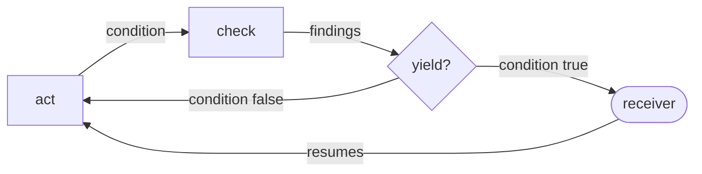

# Acts, Checks, and Yields

Acts, checks, and yields are Loop's contract shape
([Doc-Type](/doc-types/doc-type.md)): the form every Loop's contract
takes. A loop drives a state toward a target state by iteratively
taking prescribed actions and validating against prescribed standards
([Loop](/doc-types/loop/definition.md)).

## The shape

- **Act.** A prescribed action: a pointer at a runbook, with a
  condition. The act reads the findings the checks before it returned;
  that is how direction reaches it.
- **Check.** A prescribed standard: a pointer at `Standard.audit`, the
  auditors a card's audit cell locates, with a condition. A check returns findings, each
  naming a member and the rule it fails. Zero findings from every check
  is the target state. The target is written once, in the standards,
  and a check runs the audit to measure the distance.
- **Yield.** A programmed exit: a condition and a receiver, another
  loop or the user. The instance writes "yields when …". A yield is
  resumable: control comes back to the same step with the receiver's
  answer.
- **Condition.** What must hold for a step to fire. Runbook and Standard already name this part
  *condition*, an edge's and a rule's; Loop reuses the word rather than
  adding a third. A condition of `None` fires every iteration.

The composition rule: any number of acts, checks, and yields, in
iteration order. Each is a step; a step whose condition holds fires,
and a yield that fires hands control out at its place in the iteration.
The shape in pseudocode:

```python
class Loop(Object):
    """Acts, checks, and yields, iterated. Drives state, never binds it."""

    operations = {act, check, yield}                                # the kinds of step, below

    steps: list[Act | Check | Yield]    # any number, in iteration order

    location    = path == f"loops/{name}.md"
    frontmatter = type == "Loop"

    def drive(self, state, findings=()):
        while True:
            for step in self.steps:
                if not step.condition(state, findings):
                    continue
                match step:
                    case Act():    state = step.runbook(state, findings)
                    case Check():  findings = step.standard.audit(state)    # runs the Audit cell's detectors
                    case Yield():  findings = yield_to(step.receiver, findings)   # resumes here


class Act:
    runbook:   Runbook              # a skill or an agent definition
    condition: Condition | None     # None fires every iteration

class Check:
    standard:  Standard             # composed as standard.audit; never its gate
    condition: Condition | None

class Yield:
    receiver:  Loop | User          # who takes control, and hands it back
    condition: Condition | None     # "yields when …"
```

A loop carries no target field and no runtime: the standards the
checks point at describe the target, and whatever runs the loop is the
substrate, not the loop
([System Legibility](/docs/system-legibility.md#standing-principles)).

## The graph

[Working in Loops](/docs/working-in-loops.md#a-loop-is-a-graph) says
every loop is a graph, and the graph form is the one used for
visualization, tracking, and resuming. The same shape drawn that way:
the three verbs and the receiver are the nodes, the conditions are the
edges.



The doc-type carries both forms, the pseudocode for the contract and
the graph for the reader. An instance pivots to the graph: its steps
drawn as nodes and edges in iteration order, so the shape on screen is
the whole procedure and the position in it is data.

## The view

The view is the graph itself. A Loop instance's source of truth is one
fenced Mermaid block, and GitHub renders it; there is no generated
table and no generator. That the graph and the prose around it agree
is a lint's job, as [the encoding](/doc-types/loop/encoding.md) lays
out; the peers share the bundle, not the file format.
