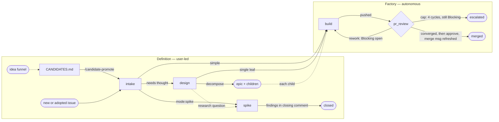

# Software Factory

How an idea becomes a merged pull request — or, on the spike path, an answered
question.

The system has two **regions**, divided by what kind of work each does:

- **Definition — user-led.** Intent extraction. An idea becomes a tracked issue
  carrying a brief an implementer can build from: what the work is, why, and
  where it stops. Most of what gets decided here is only in the user's head, so
  the region is interview-shaped and unhurried by design. Its states are below;
  its skills are invoked by the user directly.
- **The factory — autonomous.** Implementation in the wide sense: build, review,
  rework, and the path to merge. Handed a ready issue it runs unattended,
  stopping only where the user's capability or decision is required. Its
  operating contract is
  [factory-operations.md](/software-factory/factory-operations.md); every point
  where it stops is
  [user-checkpoints.md](/software-factory/user-checkpoints.md).

This document is the map both regions share: the states and the moves between
them.

## The graph

Solid edges are state moves; dotted edges are informational.

Three edges leave the definition subgraph, and they are the only entries to the
factory: intake's release and design's single leaf, both state moves, plus an
epic's children — dotted because the epic itself never crosses; each child enters
`build` as a leaf of its own.

## The definition region

Work enters as an idea and leaves as an issue a factory node can pick up. Every
state below is user-led; the skills serving them are invoked by the user, never
dispatched by the factory.

**Before the issue.** The idea funnel feeds `CANDIDATES.md`, a repo's register of
work described but not yet committed to
([candidates.md](/standards/tracking/candidates.md)). A Candidate is pre-issue:
no issue exists, so no label does either. `/candidate-promote` is the elevator —
it finds the entry, opens intake on it, and deletes the entry as the issue lands.

**`intake` — accounting and routing.** Every issue passes through, whether minted
fresh, adopted as a rushed stub, or promoted from a Candidate. Intake grills for
what the work actually is, assigns the metadata triple (`category:*`, `mode:*`,
`tests:*`), and authors the brief when the work is simple enough to specify on
the spot. Then it routes: release the issue to the factory, or park it at
`design` because the approach needs thought first. Intake's label writes are its
deliverable — triage *is* the four-tuple.

**`design` — research and decomposition.** The approach is explored here:
research, prototypes, tradeoffs. Prototyping happens in a disposable worktree
that is deleted on exit; the `prototype/<issue>` branch pushed from it survives
as the citable artifact
([issue-authoring.md](/standards/tracking/issue-authoring.md#brief-principles)).
Nothing merges out of definition — a prototype branch never merges, and pushing
a dead-end branch is not merging. A design session exits one of two ways:

- **A single leaf.** The chosen approach is written back into the issue by
  re-authoring its brief, and the issue-review verdict releases the issue to the
  factory. The thinking lands in the brief's own headings; there is no separate
  approach section for a builder to reconcile against.
- **Decomposition.** When the work is too big for one leaf, the issue becomes an
  **epic** and never builds itself; its children carry the work. Children are
  minted here rather than at the intake node, carrying a starting brief and
  unreleased — a child is incomplete when it leaves the decomposing session.
  Each returns to `design` in a session of its own, which re-authors its brief
  and crosses it into the factory on its issue-review verdict. The epic body carries
  the outcome and the decomposition rationale
  ([issue-authoring.md](/standards/tracking/issue-authoring.md)).

**`spike` — a question, not a change.** A spike is an issue whose deliverable is
an answer. Everything it produces lands on the issue itself: the findings in its
closing comment, plus a
[Decision Record](/standards/decisions/records.md) if a one-way door was crossed.
No PR opens and nothing persists in git — the branch and worktree are disposable.
A spike may stand alone or serve a design effort, where its answer shapes how an
epic slices. A question that turns out to need an interview to answer was design,
not a spike.

**The readiness bar.** What makes an issue ready to leave the region — a leaf,
unblocked, brief-complete, released at an issue-review verdict — is
defined once in
[issue-authoring.md](/standards/tracking/issue-authoring.md#readiness).

## The factory

`build` implements, and `pr_review` audits in cycles. The graph draws `pr_review`
as one node because it is one state an issue occupies; the loop inside it is
here. Each cycle runs the reviews the diff elects, all at once, and the verdict
on what they posted is the traverse script's rather than anyone's judgment: it is
computed from the pull request's thread state.

Open Blocking threads send the issue back to `build` for another lap. None open
is `pr-ready`, and the user's final read and merge follow. Blocking threads still
open after four autonomous cycles end the traverse escalated — a pull request
that is not converging on its own reaches the user rather than looping on.
Nothing else re-enters.

`pr-ready` means converged on Blocking alone. Open Suggestion threads may still
be on the pull request, and that is a real state rather than an oversight: a
Suggestion is dispositioned at the merge boundary, so until the user gets there
it simply stays open and no cycle counts it against convergence. What each node
does, who runs it, and under what contract is
[factory-operations.md](/software-factory/factory-operations.md).

## Labels

The labels naming these states are defined in
[factory-labels.md](/standards/tracking/factory-labels.md).
