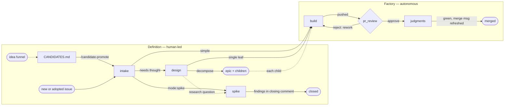

# Software Factory

How an idea becomes a merged pull request — or, on the spike path, an answered
question.

The system has two **regions**, divided by what kind of work each does:

- **Definition — human-led.** Intent extraction. An idea becomes a tracked issue
  carrying a brief an implementer can build from: what the work is, why, and
  where it stops. Most of what gets decided here is only in the human's head, so
  the region is interview-shaped and unhurried by design. Its states are below;
  its skills are invoked by the human directly.
- **The factory — autonomous.** Implementation in the wide sense: build, review,
  rework, and the path to merge. Handed a ready issue it runs unattended,
  stopping only where the human's capability or decision is required. Its
  operating contract is
  [factory-operations.md](/software-factory/factory-operations.md); every point
  where it stops is
  [checkpoints.md](/software-factory/checkpoints.md).

This document is the map both regions share: the states, the moves between them,
and the labels that name them.

## The graph

Solid edges are state moves; dotted edges are informational.

Three edges leave the definition subgraph, and they are the only entries to the
factory: intake's release and design's single leaf, both state moves, plus an
epic's children — dotted because the epic itself never crosses; each child enters
`build` as a leaf of its own.

## The definition region

Work enters as an idea and leaves as an issue a factory node can pick up. Every
state below is human-led; the skills serving them are invoked by the human, never
dispatched by the factory.

**Before the issue.** The idea funnel feeds `CANDIDATES.md`, a repo's register of
work described but not yet committed to
([candidates.md](/standards/tracking/candidates.md)). A Candidate is pre-issue:
no issue exists, so no label does either. `/candidate-promote` is the elevator —
it finds the entry, opens intake on it, and deletes the entry as the issue lands.

**`intake` — accounting and routing.** Every issue passes through, whether minted
fresh, adopted as a rushed stub, or promoted from a Candidate. Intake grills for
what the work actually is, assigns the metadata triple (`category:*`, `mode:*`,
`tests:*`), and authors the brief when the work is simple enough to specify on
the spot. Then it routes: release the issue to the factory, or park it at
`design` because the approach needs thought first. Intake's label writes are its
deliverable — triage *is* the four-tuple.

**`design` — research and decomposition.** The approach is explored here:
research, prototypes, tradeoffs. Prototyping happens in a disposable worktree
that is deleted on exit; the `prototype/<issue>` branch pushed from it survives
as the citable artifact
([issue-authoring.md](/standards/tracking/issue-authoring.md#brief-principles)).
Nothing merges out of definition — a prototype branch never merges, and pushing
a dead-end branch is not merging. A design session exits one of two ways:

- **A single leaf.** The chosen approach is written back into the issue by
  re-authoring its brief, and the issue-review verdict releases the issue to the
  factory. The thinking lands in the brief's own headings; there is no separate
  approach section for a builder to reconcile against.
- **Decomposition.** When the work is too big for one leaf, the issue becomes an
  **epic** and never builds itself; its children carry the work. Children are
  minted here rather than at the intake node, carrying a starting brief and
  unreleased — a child is incomplete when it leaves the decomposing session.
  Each returns to `design` in a session of its own, which re-authors its brief
  and crosses it into the factory on its issue-review verdict. The epic body carries
  the outcome and the decomposition rationale
  ([issue-authoring.md](/standards/tracking/issue-authoring.md)).

**`spike` — a question, not a change.** A spike is an issue whose deliverable is
an answer. Everything it produces lands on the issue itself: the findings in its
closing comment, plus a
[Decision Record](/standards/decisions/records.md) if a one-way door was crossed.
No PR opens and nothing persists in git — the branch and worktree are disposable.
A spike may stand alone or serve a design effort, where its answer shapes how an
epic slices. A question that turns out to need an interview to answer was design,
not a spike.

**The readiness bar.** What makes an issue ready to leave the region — a leaf,
unblocked, brief-complete, released at an issue-review verdict — is
defined once in
[issue-authoring.md](/standards/tracking/issue-authoring.md#readiness).

## The factory

`build` implements, `pr_review` audits and takes the human's verdict, and
`judgments` settles the semantic gate before the human's final read and merge. A
rejected review returns to `build`; nothing else re-enters. What each node does,
who runs it, and under what contract is
[factory-operations.md](/software-factory/factory-operations.md).

## Labels

The state of an issue is written on the issue, as labels. Every **leaf** — the
unit of work — carries the full four-tuple `(category:*, mode:*, tests:*,
phase:*)`, with `phase:*` naming its current node. An **epic** is not a leaf: it
never dispatches and carries `category:*` alone; its children carry the work.
Roles are derived, never labeled
([issue-authoring.md](/standards/tracking/issue-authoring.md)).

An untriaged issue may carry `phase:intake` or no labels at all — either way it
is untriaged, with `phase:intake` the implied default. Issue **relationships** —
hierarchy and blocked-by — are native GitHub relationships, tracked outside this
tuple.

### Valid labels

The factory's labels are exactly these: the fixed-value labels in the table
below, plus one `phase:*` label per work node, derived per [Naming](#naming).
[bootstrap-labels](/scripts/bootstrap-labels) mints them.

The scheme carries dimensions beyond the factory's. Each is governed where it is
defined — `wayfinder` by
[Wayfinding operations](/standards/tracking/tracker-operations.md#wayfinding-operations)
— and this doc restates none of their values.

| Dimension | Label | Meaning |
|---|---|---|
| Category | `category:maintenance` | Maintains shipped state — a bug fix, hygiene, or polish that adds no new capability. |
| Category | `category:extension` | Extends a system past its shipped line — a capability it does not have today. |
| Mode | `mode:direct` | The ordinary path: an issue that ends in merged code. |
| Mode | `mode:spike` | A question; the answer closes the issue, no PR. Always `tests:no` — a spike merges nothing. |
| Tests | `tests:yes` | The work writes or modifies tests, so `build` runs it test-first. |
| Tests | `tests:no` | The work touches no tests, so `build` implements directly. |

Every mode either fixes `tests:*` or splits on it, so the four-tuple is complete
on every leaf. Category is required metadata and affects no routing.

### Naming

A phase label is its node id with `_` mapped to `-`, `phase:`-prefixed: node
`pr_review` → label `phase:pr-review`.

**The parity invariant.** The graph's work nodes — its rectangles and diamonds —
mapped that way must equal the scheme's `phase:*` values exactly. The inventory:
`intake, design, spike, build, pr-review, judgments`. A scheme value no node
answers to, or a node no scheme value names, is the violation; the
`scheme-vs-graph` judgment enforces it. Two things are exempt, and only these:

- **Pre-issue states** — `CANDIDATES.md` and the idea funnel. No issue exists, so
  there is nothing to label.
- **Terminal endpoints** — merged, closed. An issue leaves the graph there rather
  than occupying a state.

A work node is usually served by a slash-command of the same name (`design` →
`/design`), but the mapping is not guaranteed: a review diamond dispatches
several skills, none named after the node.
