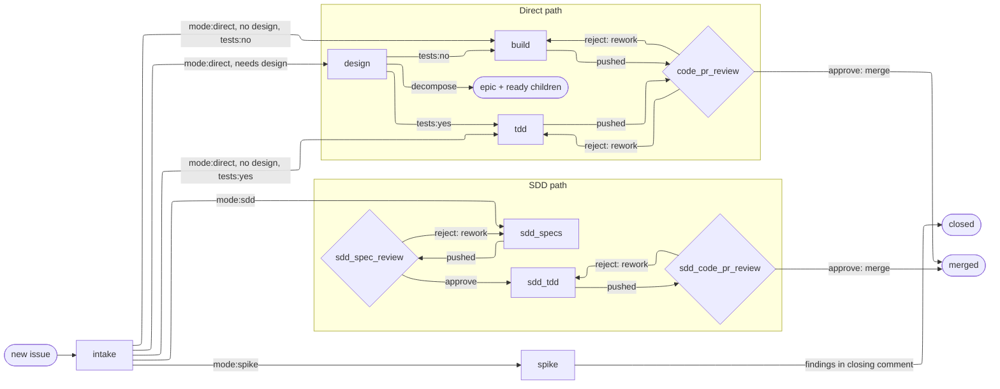

# Workflow

Standard workflow for how ideas become merged PRs — or, on the spike path, answered questions — in a workspace repo.

## State machine

Every post-intake **leaf** carries the full four-tuple `(category:*, mode:*, tests:*, phase:*)`, with `phase:*` naming its current node. Before intake, a rushed issue may carry only `phase:intake` or no labels at all — either way it is untriaged, with `phase:intake` the implied default. Assigning the metadata triple and advancing the phase is intake's job. An **epic** — an issue decomposed into sub-issues — is not a leaf: it never dispatches and needs only `category:*`; its children carry the work. The state of a post-intake leaf is the `(mode, tests, phase)` sub-triple — each node below is one reachable combination. Category is required metadata but does not affect routing.

- `category:*` — `category:bug` (broken or incorrect) or `category:enhancement` (new behavior or improvement; covers everything that isn't a bug, including docs, config, refactors, and chores). Picked at intake.
- `mode:*` — `mode:sdd`, `mode:direct`, or `mode:spike`. Picked at intake.
- `tests:*` — `tests:yes` or `tests:no`. Picked at intake. `mode:sdd` always carries `tests:yes`; `mode:direct` is split — testable work goes `tests:yes` (implemented at `tdd`), doc/config/work not touching tests goes `tests:no` (implemented at `build`); `mode:spike` always carries `tests:no` — a spike merges no code — so the full-tuple invariant holds on every leaf.
- `phase:*` — the current node in the graph below. An untriaged issue is at `phase:intake` — labelled so, or implied by carrying no labels at all. The graph is the inventory; see [Naming](#naming).

Issue **relationships** — hierarchy (sub-issues) and dependency (blocked-by) — are tracked natively, separate from this label tuple; see [issue-conventions § Relationships](/standards/tracking/issues.md).

### Valid labels

[bootstrap-labels](/scripts/bootstrap-labels) mints exactly these. Eight fixed-value labels enumerated below, plus all `phase:*` labels derived from work nodes per [Naming](#naming).

| Dimension | Label | Meaning |
|---|---|---|
| Category | `category:bug` | Something is broken or incorrect. |
| Category | `category:enhancement` | New behavior or improvement; covers everything that isn't a bug. |
| Mode | `mode:sdd` | SDD path: spec → design → TDD ceremony. |
| Mode | `mode:direct` | Direct path: no spec/design ceremony. |
| Mode | `mode:spike` | Spike path: a timeboxed question; the answer closes the issue, no PR. |
| Tests | `tests:yes` | Issue involves writing or modifying tests. |
| Tests | `tests:no` | Issue does not touch tests. |
| Status | `status:parked` | Decided and dormant: triage skips it; remove the label to revive. |

### Graph-based flow

Each node engages the human one of two ways — the taxonomy [Dispatch](#dispatch) executes:

- **AFK** (away from keyboard) — the issue overwatch delegates the node to a subagent, which does the work and reports (e.g. `tdd`, `build`, `sdd_tdd`, `spike`).
- **HITL** (human in the loop) — the issue overwatch itself interviews the user and does the work with them (e.g. `intake`, `sdd_specs`, `design`).

A review node (diamond) is one or more AFK delegations followed by a HITL follow-up — subagents audit and post findings, then the overwatch takes the user's verdict — sequenced by the issue overwatch within the one node.

On the direct path, intake also decides whether the work needs a **design** pass. Substantive work routes through `design` first — where the approach is explored (and prototyped, in the issue's worktree) and the chosen solution and its tradeoffs are written into the issue body; trivial work bypasses it and lands straight at its implementation node. One `design` node serves both `tests:*` values, routing onward to `tdd` or `build` by the test dimension. The direct path carries no design-review gate — the design is captured in the issue and validated downstream at code review.

**The decompose exit.** When design concludes the issue is too big to build as one leaf, the issue becomes an **epic** and never builds itself. The decomposing design session performs the children's intake in place, minting each child as a ready leaf — full tuple, brief-complete body per the [tracking standard](/standards/tracking/issues.md) — with no round-trip through the intake node.

**The spike path.** `mode:spike` is a timeboxed question whose deliverable is an answer, not merged code. The spike node runs AFK; its findings land in the issue's closing comment — plus a [Decision Record](/standards/decisions/adrs.md) if a one-way door was crossed. No PR opens, and the branch and worktree are disposable. A spike that needs a human interview mid-flight was design, not a spike — the subagent escalates rather than interviews.

### Naming

Phase labels and slash-commands derive from graph node ids by `_`→`-`. Example: node `sdd_spec_review` → label `phase:sdd-spec-review`, command `/sdd-spec-review`. The set of work nodes — the graph's rectangles and diamonds; terminal markers mint nothing — IS the phase-label inventory.

The issue overwatch moves the `phase:*` label to the next node when a node finishes — one writing session per issue, per [Dispatch](#dispatch); node skills do the work and report. The exception is intake, whose label writes are the deliverable: triage *is* the four-tuple. Nothing launches itself: the overwatch sequences every node, and the human launches the overwatch.

One long-lived branch and PR per issue — spikes open none. The branch is built up across phases in the issue's worktree (see [Worktrees](#worktrees-and-branches)); the human's push crosses each `pushed` edge, and at code review the node's first delegation opens the PR; the human merges it on `approve: merge` in the GitHub UI, per [Pull requests](#pull-requests).

## Worktrees and branches

An issue runs under **one issue overwatch** that builds a continuous line of work across its phases. Isolation — from other issues and from the main checkout — comes from giving each issue its own **git worktree**. The worktree is opened once and the issue stays in it for its life.

### The per-issue worktree

- **One worktree, one branch, one PR per issue,** at `<repo>/.claude/worktrees/issue-<N>` on branch `issue-<N>` (`N` is the issue number).
- **Opened once, then persisted.** The issue overwatch opens it at the first file-touching node. cwd and worktree survive a `/clear`, so an overwatch re-invoked after one inherits them with no re-entry.

### The worktree contract

Every file-touching node sits in the issue's worktree:

- **Open (first file-touching node).** The issue overwatch opens it, gated on a tap-free check that the local `origin/main` ref matches origin (`git rev-parse origin/main` against `gh api …/branches/main`); a stale base escalates, since pulling is the human's. Open with `EnterWorktree(name=issue-<N>)`, which branches from `origin/main` because `worktree.baseRef` is pinned to `fresh` in user `settings.json` — so the base is `origin/main` whatever branch the main checkout sits on. Then rename the branch to the bare `issue-<N>`: Agent view's cleanup keys on the `worktree-` prefix, so dropping it lets the worktree outlive a torn-down session.
- **Inherit (everything after).** AFK subagents inherit the worktree as their cwd; the overwatch itself keeps it across `/clear`. Every later node confirms the worktree is present — escalating if it's gone, since the issue's work would be lost.
- **Tear down (Agent-view overwatch, post-merge).** When the issue lands, the Agent-view overwatch removes the local side — `git worktree remove .claude/worktrees/issue-<N>` and `git branch -D issue-<N>` — only after the human confirms the merge happened. A spike's worktree goes the same way when its issue closes.

### The agent-capability boundary

What the agent can do on GitHub is set by its PAT: it authorizes the HTTPS API — the `gh` family and REST endpoints — but not pushing over the SSH remote, and not merging a PR (`mergePullRequest` is forbidden to it). So three operations fall to the human: `git push` and `git pull`, whose SSH remote needs a YubiKey tap in the human's own terminal, and merging the PR, in the GitHub UI. Everything the PAT authorizes — and all purely-local git, which needs no GitHub auth at all — the agent does inside a skill. Under auto mode the PAT is necessary but not sufficient: the classifier must also pass each `gh` write, which the `autoMode.allow` entry in `settings.json` grants (see [Permissions](#permissions)).

| | Agent-capable | Owner |
|---|---|---|
| `git push` (publish committed work to origin, after any committing phase) | no | human |
| `git pull` (keep local `main` current) | no | human |
| merge the PR (`approve: merge`, in the GitHub UI) | no | human |
| `gh pr create` / `gh api` / `gh issue` / `gh pr diff` | yes | skills |
| commit, `EnterWorktree`/`ExitWorktree`, `git branch -m`, `git worktree remove` | yes | skills |

Consequences that shape the flow:

- **The implementation node never opens the PR.** It cannot push, and an AFK subagent cannot pause mid-run to wait for a tap. So it commits and reports; the PR is created downstream, after the push.
- **The push is the human's transition ritual.** Any committing node leaves its branch `unpushed`; the human pushes (one tap) before the next node — a turn boundary of the issue overwatch, which surfaces the push command targeted at the issue's worktree.
- **The PR is born at code review.** `/open-pr` — the code-review node's first AFK delegation — creates it with `gh pr create` once the branch is on origin, tap-free. If the branch isn't pushed yet, `/open-pr` escalates rather than guessing.
- **The merge is the human's; cleanup is the Agent-view overwatch's.** The PAT cannot merge (`mergePullRequest` is forbidden), so on `approve: merge` the human squash-merges in the GitHub UI — dropping the origin branch and closing the issue via `Closes #<N>`. The Agent-view overwatch then tears down the local side once the human confirms the merge, per the worktree contract above.

## Pull requests

One PR per issue — spikes open none — born at code review and squash-merged by the human. [Repository settings](/standards/tracking/repo-settings.md) make every merge squash-only with the message taken from the PR, so the PR title and body become the permanent commit message on `main`. The format is therefore normative:

- **Title** — states the change: it is the commit subject `main`'s history will carry.
- **Body** — a summary of what changed and why, plus the mandatory `Closes #<N>` line that closes the issue on merge.

## Dispatch

The unit of dispatch is the **issue**. The human launches one **issue overwatch** per issue in **Agent view** — the official name of the `claude agents` dashboard — and that overwatch owns the issue's whole traverse: it reads the graph from this document and executes it, delegating AFK nodes to subagents and switching to direct interview with the user at HITL nodes. The node sequence is never hard-coded into any skill — the graph above is the single source.

Two overwatch scopes, two screens:

- **Agent-view overwatch** (left screen) — fleet scope: reads the board, recommends what to launch next, tears down worktrees after confirmed merges.
- **Issue overwatch** (right screen) — issue scope, one per issue: executes that issue's traverse and surfaces its human git commands — the push at each committing boundary, the pull on a stale base.

Two terminals is the user's stated comprehension limit — a design constraint, not an implementation detail: nothing in this model may require the human to watch a third screen.

**Delegation.** An AFK node is delegated to a subagent whose prompt is `run /<skill> <N>` — nodes stay skills. Each subagent gets a fresh context window and inherits the issue's worktree as cwd; it reloads what it needs from the issue (`gh issue view <N>`) and the worktree, does the work, and ends with a terminal report. Nothing carries over from the overwatch's context.

**Turn boundaries align with the human capability points** — the push tap, the HITL nodes, the merge. The overwatch runs free between them, chaining AFK delegations where the graph allows, and ends its turn wherever only the human can act: a branch needs a push tap, a HITL node needs the interview, a PR awaits the merge verdict.

**`/clear` is the human's context reset.** The human may `/clear` after finishing a HITL node, shedding the interview's context before the next stretch. cwd and worktree survive, and the issue overwatch persists as a re-invocation of its skill — it re-orients from the issue's labels and the worktree it still sits in.

**The terminal report contract.** A subagent's final message MUST begin at character one with exactly `DONE: <one-line outcome>` or `ESCALATE: <one-line reason>`; detail follows below; any non-matching final message is treated as ESCALATE — malformed fails safe, toward the human.

**ESCALATE bubbles up.** An escalation always reaches the human: the issue overwatch adds context — which node, what it attempted, what the report says — and stops. It never overrides or self-fixes a node's escalation; the human's call routes the issue onward.

**Single label writer.** One writing session per issue — the session sequencing it. An AFK subagent never writes a label; a HITL skill runs inline in the sequencing session, so its label writes are that session's own. That is what lets intake — the one skill whose deliverable is the label tuple itself — write its four-tuple identically under the overwatch or run standalone by the human. Every other label move is the overwatch's, made as a node finishes: no subagent can advance the board out from under the session that sequences it.

**Readiness.** An issue overwatch may launch on any **unblocked** issue — every issue in its blocked-by set closed (see [issue-conventions § Relationships](/standards/tracking/issues.md)) — with intake as its first HITL node when the issue is untriaged. Crossing into an implementation node requires more: the issue must be a **leaf** (epics never dispatch) with a brief-complete body per the [tracking standard](/standards/tracking/issues.md). Blocked is a derived state GitHub surfaces in the Issues tab and Projects, not a label.

Anthropic subscription billing requires interactive sessions: the human launches each issue overwatch and is present at its turn boundaries.

## Permissions

The issue overwatch's session runs in **auto mode** — a permission mode (toggled like `acceptEdits`/`plan`, or set at launch) in which a classifier judges each tool call and self-approves the safe ones, blocking whatever escalates beyond the request, targets unrecognized infrastructure, or looks driven by hostile content it read. Auto mode does not honor the tool-pattern `permissions.allow` list the way default mode does — on entry it drops broad and wildcarded `Bash(...)` allows — so each command is weighed by the classifier, not waved through by a saved pattern.

To permit something the classifier would otherwise block, add an entry to the `autoMode.allow` list in `settings.json`. Entries are natural-language descriptions, not tool patterns — the classifier reads them as rules — and are honored from user scope (`~/.claude/settings.json`) and project-local (`.claude/settings.local.json`), but not from checked-in project settings. The list's first entry is the literal string `"$defaults"`: it tells the classifier to keep its built-in rule set in force, so the entries you add **extend** the defaults rather than replace them.

**The commit-authorization token.** The literal token `⟦AUTONOMOUS-COMMIT-AUTHORIZED⟧` pre-authorizes `Skill(commit)` for any session whose launch prompt carries it — an uncommon bracketed string recognized as the lone commit exception. It rides AFK delegation prompts only, affixed by the issue overwatch: a subagent is a separate session, its delegation prompt is its launch prompt, and the AFK implementation nodes commit with no human present to say "commit now" — the token is what lets them, with the work reviewed at the PR rather than diff-by-diff. The overwatch's own launch prompt carries no token, and needs none: the overwatch session commits only inside inline HITL nodes, where the user's phase-close approval authorizes in the moment. A standing commit grant on the long-lived, content-ingesting overwatch session would be privilege it never uses.

**Subagent permissions are consciously wide.** Subagent-level tool permissions are out of scope for this model: subagents run under auto mode with wide permissions, and the reviewer read-only guarantee — a reviewer reports findings, never rewrites the work under review — is prompt-level for now. This is accepted deliberately; a later pass may tighten it.

From the first file-touching node on, the session is cwd-bound to the issue's worktree, which confines its file reach.

Canonical front-matter and syntax: [skills](https://code.claude.com/docs/en/skills.md), [permissions](https://code.claude.com/docs/en/permissions).

## Skills

Two modes of human engagement:

- **Human in the loop (HITL)** — the human is actively engaged throughout, spending real time and focus. Use this for stages that extract human intent. The issue overwatch runs these nodes itself, in direct interview.
- **Hands off the wheel (AFK)** — the agent runs autonomously with no human involvement; the human sees only the terminal report. The issue overwatch delegates these nodes to subagents.

### Node-skill contract

A node skill does the node's work and reports; the issue overwatch launches it, sequences what follows, and writes the labels (intake excepted — its label tuple is the deliverable, per [Dispatch](#dispatch)). When a skill has required reading, it front-loads a `## Read first` section ending in a `READ: <files>` confirmation; when it has none, it omits the section entirely. This contract fixes structure; the authoring *style* behind the skills — voice, content, robustness, mechanics — lives in [skill-authoring.md](/workflow/skill-authoring.md).

- **Worktree.** Every file-touching node sits in the issue's worktree before doing anything else, per [Worktrees](#worktrees-and-branches). `intake` touches no files and uses no worktree.
- **HITL** — the issue overwatch runs the node itself, so the body may gate on interviews and approvals — asked via `AskUserQuestion` or plain terminal prompts — and the node closes with a plain report.
- **AFK** — a subagent runs the skill hands-off and terminates per the terminal report contract ([Dispatch](#dispatch)): `DONE:` on success, `ESCALATE:` when stuck, with the skill's escalation triggers listed in the table.
- **Gate.** A committing node runs `make check` — the full gate, not just the commit hooks — before finishing its phase; a phase never closes over a red tree. The rule is per-phase, not per-commit: individual commits are already covered by the commit gate's hook suite, and the full gate is the phase-close ritual.

The table lists every skill the issue overwatch dispatches. Nodes and skills intersect imperfectly: most work nodes are served by a skill of the same name; the code-review nodes add two within-node delegations (`/open-pr`, and the native `/code-review`, whose wrapping subagent is prompted to close per the terminal report contract); and `spike` is a node with no skill yet — the overwatch escalates rather than dispatching a skill that doesn't exist. Helpers a node skill invokes itself (`/commit`, `/grill-with-docs`) are not dispatch surfaces and stay out. Every file-touching skill also escalates when the issue's worktree is missing, per [the worktree contract](#the-worktree-contract); the stale-base check belongs to the overwatch at worktree-open, so the table lists only each skill's own triggers beyond both.

| Skill | Engagement | Escalation triggers |
|-------|------|---------------------|
| `/intake` | HITL | — |
| `/sdd-specs` | HITL | — |
| `/design` | HITL | — |
| `/sdd-tdd` | AFK | Interface amendment / spec gap; stalling ambiguity; issue too big for one session; test red after 2 attempts |
| `/tdd` | AFK | Brief wrong or underdetermined; issue too big for one session; test red after 2 attempts |
| `/build` | AFK | Brief wrong or underdetermined; issue too big for one session; work needs tests (mis-triaged) |
| `/open-pr` | AFK | branch not pushed to origin |
| `/code-review` (native) | AFK | — (built-in; posts findings as a PR comment) |
| `/sdd-spec-review` | AFK | Consistency gate red (malformed spec); specs absent/unreadable |
| `/sdd-code-pr-review` | AFK | Green gate red (PR over red tree); PR/diff missing |
| `/code-pr-review` | AFK | Green gate red (PR over red tree); PR/diff missing |

**The code-review sequence.** At `code_pr_review` and `sdd_code_pr_review` the issue overwatch sequences three AFK delegations, then goes HITL: `/open-pr` creates the PR from the just-pushed branch; the native `/code-review` posts its automated bug/regression findings as a PR comment; our review skill adds the fidelity and convention findings the native pass does not cover — running last so it can read the native comment and skip re-flagging. With the audit complete, the overwatch interviews the human for the verdict: merge, or rework back to the implementation node.
