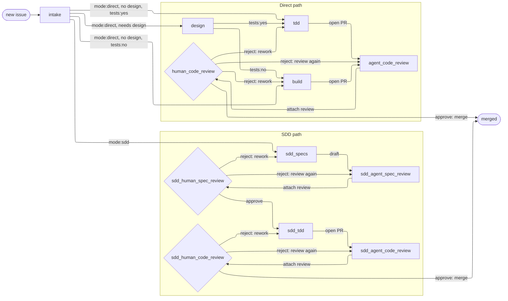

# Workflow

Standard workflow for how ideas become merged PRs in a workspace repo.

## State machine

Every issue past intake carries the full four-tuple `(category:*, mode:*, tests:*, phase:*)`, with `phase:*` naming its current node. Before intake, a rushed issue may carry only `phase:intake` or no labels at all — either way it is untriaged, with `phase:intake` the implied default. Assigning the metadata triple and advancing the phase is intake's job. The state of a post-intake issue is the `(mode, tests, phase)` sub-triple — each node below is one reachable combination. Category is required metadata but does not affect routing.

- `category:*` — `category:bug` (broken or incorrect) or `category:enhancement` (new behavior or improvement; covers everything that isn't a bug, including docs, config, refactors, and chores). Picked at intake.
- `mode:*` — `mode:sdd` or `mode:direct`. Picked at intake.
- `tests:*` — `tests:yes` or `tests:no`. Picked at intake. `mode:sdd` always carries `tests:yes`; `mode:direct` is split — testable work goes `tests:yes` (implemented at `tdd`), doc/config/work not touching tests goes `tests:no` (implemented at `build`).
- `phase:*` — the current node in the graph below. An untriaged issue is at `phase:intake` — labelled so, or implied by carrying no labels at all. The graph is the inventory; see [Naming](#naming).

Issue **relationships** — hierarchy (sub-issues) and dependency (blocked-by) — are tracked natively, separate from this label tuple; see [issue-conventions § Relationships](~/workspace/dev-playbook/standards/issue-conventions.md).

### Valid labels

[bootstrap-labels](~/workspace/dev-playbook/tools/bin/bootstrap-labels) mints exactly these. Six fixed-value labels enumerated below, plus all `phase:*` labels derived from graph nodes per [Naming](#naming).

| Dimension | Label | Meaning |
|---|---|---|
| Category | `category:bug` | Something is broken or incorrect. |
| Category | `category:enhancement` | New behavior or improvement; covers everything that isn't a bug. |
| Mode | `mode:sdd` | SDD path: spec → design → TDD ceremony. |
| Mode | `mode:direct` | Direct path: no spec/design ceremony. |
| Tests | `tests:yes` | Issue involves writing or modifying tests. |
| Tests | `tests:no` | Issue does not touch tests. |

### Graph-based flow

Each node also has two attributes: `(actor ∈ {agent, human}, role ∈ {work, review})`. Four kinds:

- `(agent, work)` — agent produces output (e.g., `sdd_tdd`, `tdd`, `build`)
- `(agent, review)` — agent reviews work, attaches findings (e.g., `sdd_agent_spec_review`, `agent_code_review`)
- `(human, work)` — human produces output (e.g., `intake`, `sdd_specs`, `design`)
- `(human, review)` — human reads and decides (e.g., `sdd_human_spec_review`, `human_code_review`)



On the direct path, intake also decides whether the work needs a **design** pass. Substantive work routes through `design` first — where the approach is explored (and prototyped, in the issue's worktree) and the chosen solution and its tradeoffs are written into the issue body; trivial work bypasses it and lands straight at its implementation node. One `design` node serves both `tests:*` values, routing onward to `tdd` or `build` by the test dimension. The direct path carries no design-review gate — the design is captured in the issue and validated downstream at code review.

### Naming

Phase labels and slash-commands derive from graph node ids by `_`→`-`. Example: node `sdd_agent_spec_review` → label `phase:sdd-agent-spec-review`, command `/sdd-agent-spec-review`. The set of graph nodes IS the phase-label inventory.

Each work or agent-review node's skill updates the issue's `phase:*` label to the next node when it finishes. The three human-review nodes share one skill, `/human-review`: it reads the `phase:*` label to place itself, lays out the prior agent review and the artifact, and executes the human's verdict — advancing on approve (the human merges the PR at a code node), or routing the label back to an earlier node on `reject` (`review again`, `rework`). This is the one command whose name does not derive from a node id: it serves `sdd_human_spec_review`, `sdd_human_code_review`, and `human_code_review` at once. The human launches every node (per [Dispatch](#dispatch)) — nothing launches itself.

One long-lived branch and PR per issue. The branch is built up across phases in the issue's worktree (see [Worktrees](#worktrees-and-branches)); the PR opens on the `open PR` edge — after the human pushes the branch — and the human merges it on `approve: merge` in the GitHub UI.

## Worktrees and branches

An issue runs in **one session** that builds a continuous line of work across its phases. Isolation — from other issues and from the main checkout — comes from giving each issue its own **git worktree**. The session opens the worktree once and stays in it for the issue's life.

### The per-issue worktree

- **One worktree, one branch, one PR per issue,** at `<repo>/.claude/worktrees/issue-<N>` on branch `issue-<N>` (`N` is the issue number).
- **Opened once, then persisted.** The issue's first file-touching node opens it; `/clear` between nodes keeps the session's cwd inside it (cwd and worktree both survive a `/clear`), so every later node inherits it with no re-entry.

### The worktree contract

Every file-touching node ensures the session sits in the issue's worktree, then works in cwd:

- **Open (first node).** Gated on a tap-free check that local `main` matches origin (`git rev-parse origin/main` against `gh api …/branches/main`); a stale base escalates, since pulling is the human's. Open with `EnterWorktree(name=issue-<N>)`, which branches from `origin/main` because `worktree.baseRef` is pinned to `fresh` in user `settings.json` — so the base is `origin/main` whatever branch the main checkout sits on. Then rename the branch to the bare `issue-<N>`: agent view's cleanup keys on the `worktree-` prefix, so dropping it lets the worktree outlive a torn-down session.
- **Inherit (later nodes).** cwd is already the worktree, carried across `/clear`. Every later node confirms the worktree is present — escalating if it's gone, since the issue's work would be lost — then works in it directly.
- **Tear down (merge node).** When the issue lands, step out of the worktree and remove it: `git worktree remove .claude/worktrees/issue-<N>` and `git branch -D issue-<N>`.

### The agent-capability boundary

What the agent can do on GitHub is set by its PAT: it authorizes the HTTPS API — the `gh` family and REST endpoints — but not pushing over the SSH remote, and not merging a PR (`mergePullRequest` is forbidden to it). So three operations fall to the human: `git push` and `git pull`, whose SSH remote needs a YubiKey tap in the human's own terminal, and merging the PR, in the GitHub UI. Everything the PAT authorizes — and all purely-local git, which needs no GitHub auth at all — the agent does inside a skill.

| | Agent-capable | Owner |
|---|---|---|
| `git push` (publish the branch at `open PR`) | no | human |
| `git pull` (keep local `main` current) | no | human |
| merge the PR (`approve: merge`, in the GitHub UI) | no | human |
| `gh pr create` / `gh api` / `gh issue` / `gh pr diff` | yes | skills |
| commit, `EnterWorktree`/`ExitWorktree`, `git branch -m`, `git worktree remove` | yes | skills |

Consequences that shape the skills:

- **The implementation node never opens the PR.** It cannot push, and a finger-on-the-wheel skill cannot pause mid-run to wait for a tap. So it commits, advances its label, and ends `DONE` with a reminder to push. The PR is created downstream, after the push.
- **The push is the human's transition ritual.** Seeing implementation `DONE`, the human runs `git push -u origin issue-<N>` (one tap), `/clear`s, and launches the code-review node.
- **The PR is born at code review.** `/open-pr` (first link of the code-review goal) creates it with `gh pr create` once the branch is on origin — tap-free, in a skill. If the branch isn't pushed yet, `/open-pr` escalates rather than guessing.
- **The merge is the human's; cleanup is the merge node's.** The PAT cannot merge (`mergePullRequest` is forbidden), so on `approve: merge` the human squash-merges in the GitHub UI — dropping the origin branch and closing the issue via `Closes #<N>`. `/human-review` then tears down the local side, per the worktree contract above.

## Dispatch

The human dispatcher operates from Claude Code's "claude agents" dashboard. **Each issue gets one session, launched once and held open for its whole traverse of the graph.** The launch prompt is the session's first user message; a prompt beginning `/<skill>` model-invokes that node's skill. The session runs in **auto mode** (see [Permissions](#permissions)). Anthropic subscription billing requires interactive sessions, so the human is present to launch each node.

**One session, many nodes — `/clear` between them.** A node skill works in the issue's worktree, commits, updates the `phase:*` label to the next node, and stops. Nodes do not auto-advance: the human reads the new phase, runs **`/clear`** to reset the session's context — cwd and worktree persist — then pastes the next node's launch command. Every transition stays human-gated and visible on the dashboard. Parallel issues run as independent sessions, each in its own worktree; worktrees keep them from colliding.

**Ready means unblocked.** New issues launch only if they have no open blockers — every issue in its blocked-by set is closed (see [issue-conventions § Relationships](~/workspace/dev-playbook/standards/issue-conventions.md)). Blocked is a derived state GitHub surfaces in the Issues tab and Projects, not a label; the dispatcher checks it and lets a blocked issue wait. Hierarchy (sub-issues) is organizational and does not gate dispatch.

**Re-orientation is minimal.** A node launched after `/clear` starts with a blank context. Its launch command carries only what the node needs — the skill and the issue number — and the skill reloads its own context from the issue (`gh issue view <N>`) and the worktree it already sits in. Nothing carries over from the cleared context.

The two modes invoke differently. **FOTW skills run hands-off under `/goal`**, which pairs the action with proof and a stop-clause. A FOTW skill yields control only by printing a **terminal line** — `DONE:` (work complete) or `ESCALATE:` (stuck, needs a human call) — and the goal condition stops on either:

```
/goal Run /<skill> <args> until it prints a terminal line — DONE: or ESCALATE: — or stop after N turns.
```

`/goal` is a human-only UI command; an agent cannot invoke it. It re-drives the session after every turn until its condition holds, so *every* exit must be a recognized terminal line — a skill that merely paused to ask a question would be re-driven past it. Its evaluator is text-only (it judges the transcript, calls no tools), which is why a condition must name both the proof shape (the literal `DONE:`/`ESCALATE:` line) and a turn cap. The evaluator matches the literal prefix, clears the goal, and the session idles, visible to the human at the dashboard. **HITL skills are launched directly as `/<skill> <args>`** with the human engaged throughout; they close with a plain report and need no `/goal` wrapper or terminal line.

A committing FOTW node (`build`, `tdd`, `sdd-tdd`) prepends the commit token to the goal text — see [Permissions](#permissions):

```
/goal ⟦AUTONOMOUS-COMMIT-AUTHORIZED⟧ Run /build <issue> until it prints a terminal line — DONE: or ESCALATE: — or stop after N turns.
```

## Permissions

The issue's session runs in **auto mode** — a permission mode (toggled like `acceptEdits`/`plan`, or set at launch) in which a classifier judges each tool call and self-approves the safe ones, blocking whatever escalates beyond the request, targets unrecognized infrastructure, or looks driven by hostile content it read. Auto mode does not honor the tool-pattern `permissions.allow` list the way default mode does — on entry it drops broad and wildcarded `Bash(...)` allows — so a node's commands are weighed by the classifier, not waved through by a saved pattern.

Behavior is shaped from two sides, and **deny wins anywhere** — a deny at any level (a skill's `disallowed-tools`, a `permissions.deny` rule) blocks the call regardless of the classifier or any allow. To **forbid**, list the tool in the node skill's `disallowed-tools`; the per-node deny lists are what make a role's boundaries authoritative:

- **FOTW nodes deny `AskUserQuestion`.** A hands-off skill must not stop to ask the human; it runs to a terminal line and escalates instead.
- **Review nodes additionally deny `Edit MultiEdit NotebookEdit` outright and scope `Write` to deny the work under review (`Write(/**)`), permitting only `Write(//tmp/**)` for staging a comment body.** The read-only guarantee: a reviewer reports findings, never rewrites the work under review — a scratch file in `/tmp` is the one write it may make.
- **HITL nodes deny nothing.** The human is engaged, so the skill asks freely — auto mode leaves interactive prompts available.

To **permit** something the classifier would otherwise block, add an entry to the `autoMode.allow` list in `settings.json`. Entries are natural-language descriptions, not tool patterns — the classifier reads them as rules — and are honored from user scope (`~/.claude/settings.json`) and project-local (`.claude/settings.local.json`), but not from checked-in project settings. The list's first entry is the literal string `"$defaults"`: it tells the classifier to keep its built-in rule set in force, so the entries you add **extend** the defaults rather than replace them.

Two verified properties make this safe: a `disallowed-tools` deny **holds across `/goal` re-drives**, so it covers a FOTW node's entire autonomous run; and it **does not leak across `/clear`**, so each node starts with a clean pool — a write node following a read-only review node can write. The deny lasts only while the skill is active and would clear on a human message, which is why it targets autonomous (FOTW) nodes the human never interrupts; HITL nodes, where the human does step in, carry none.

**The commit-authorization token.** The FOTW implementation nodes (`build`, `tdd`, `sdd-tdd`) commit via the `commit` skill with no human present to say "commit now", so auto mode's classifier — enforcing the deny on unattended commits — would block them. To lift the deny for exactly those sessions, the node's launch prompt carries the literal token `⟦AUTONOMOUS-COMMIT-AUTHORIZED⟧`, which pre-authorizes `Skill(commit)` for that session — an uncommon bracketed string chosen so it cannot appear by accident, recognized as the lone commit exception. HITL nodes carry no token: the human is engaged and authorizes any commit in the moment. Read-only review nodes carry none either; they commit nothing. Delivery is per [Dispatch](#dispatch).

The session is cwd-bound to the issue's worktree, which confines its file reach.

Canonical front-matter and syntax: [skills](https://code.claude.com/docs/en/skills.md), [permissions](https://code.claude.com/docs/en/permissions).

## Skills

Three modes of human engagement exist in theory; only two are available under the [Dispatch](#dispatch) model:

- **Human in the loop (HITL)** — human is actively engaged throughout, spending real time and focus. Use this for stages that focus on extracting human intent.
- **Finger on the wheel (FOTW)** — skill is designed to run hands-off; human is present only because billing requires it. Agent does the work; human invokes the skill and responds to escalations.
- **Hands off the wheel (AFK)** — agent runs autonomously, no human involvement. *Not available* — see [Dispatch](#dispatch). We would use this if we could.

### Node-skill contract

Across modes, a node skill declares the `disallowed-tools` its role calls for, copied from the [table](#skills) below — every other tool access is auto mode's call. When it has required reading, it front-loads a `## Read first` section ending in a `READ: <files>` confirmation; when it has none, it omits the section entirely. Mode fixes the rest — see [Dispatch](#dispatch) for the launch and termination mechanics. This contract fixes structure; the authoring *style* behind the skills — voice, content, robustness, mechanics — lives in [skill-authoring.md](~/workspace/dev-playbook/workflow/skill-authoring.md).

- **Worktree.** Every file-touching node ensures the session is in the issue's worktree before doing anything else, per [Worktrees](#worktrees-and-branches): the issue's first node opens it (create-and-rename), later nodes inherit cwd across `/clear`. `intake` touches no files and uses no worktree.
- **HITL** — the human is engaged throughout, so the body may gate on interviews and approvals — asked via `AskUserQuestion` or plain terminal prompts, per [Permissions](#permissions) — and the skill terminates with a plain report. Escalation is `—`: the human is already present.
- **FOTW** — the skill runs hands-off, so it terminates by printing a deterministic terminal line and declares its escalation triggers in the table. The line is `DONE:` on success or `ESCALATE:` when stuck. Escalation is a terminal line, not an in-place wait: under `/goal` the session is re-driven each turn until a terminal line appears, so to escalate is to print `ESCALATE:` and yield.

| Skill | Mode | Denies (`disallowed-tools`) | Escalation triggers |
|-------|------|-----------------------------|---------------------|
| `/intake` | HITL | — | — |
| `/sdd-specs` | HITL | — | main behind origin (stale base) |
| `/design` | HITL | — | main behind origin (stale base) |
| `/sdd-tdd` | FOTW | `AskUserQuestion` | Interface amendment / spec gap; stalling ambiguity; issue too big for one session; test red after 2 attempts |
| `/tdd` | FOTW | `AskUserQuestion` | Brief wrong or underdetermined; issue too big for one session; test red after 2 attempts; main behind origin (stale base) |
| `/build` | FOTW | `AskUserQuestion` | Brief wrong or underdetermined; issue too big for one session; work needs tests (mis-triaged); main behind origin (stale base) |
| `/open-pr` | FOTW | `AskUserQuestion` | branch not pushed to origin |
| `/sdd-agent-spec-review` | FOTW | `AskUserQuestion` `Edit` `MultiEdit` `NotebookEdit` `Write(/**)` (allows `Write(//tmp/**)`) | Consistency gate red (malformed spec); specs absent/unreadable |
| `/sdd-agent-code-review` | FOTW | `AskUserQuestion` `Edit` `MultiEdit` `NotebookEdit` `Write(/**)` (allows `Write(//tmp/**)`) | Green gate red (PR over red tree); PR/diff missing |
| `/agent-code-review` | FOTW | same as `/sdd-agent-code-review` | Green gate red (PR over red tree); PR/diff missing |
| `/human-review` | HITL | — | — |

**Compound dispatch — the code-review nodes.** `sdd_agent_code_review` and `agent_code_review` each run three steps in one FOTW goal: `/open-pr` creates the PR from the just-pushed branch (tap-free), the native `/code-review` posts its automated bug/regression findings as a PR comment, then our skill adds the spec-fidelity and convention findings the native pass does not cover (also a PR comment). Ours runs last so its label advance means all three are done, and so it can read the native comment and skip re-flagging. The goal chains them:

```
/goal Run /open-pr <issue>, then /code-review <pr>, then /sdd-agent-code-review <issue> — stop when /sdd-agent-code-review prints a terminal line (DONE: or ESCALATE:), or after N turns.
```
