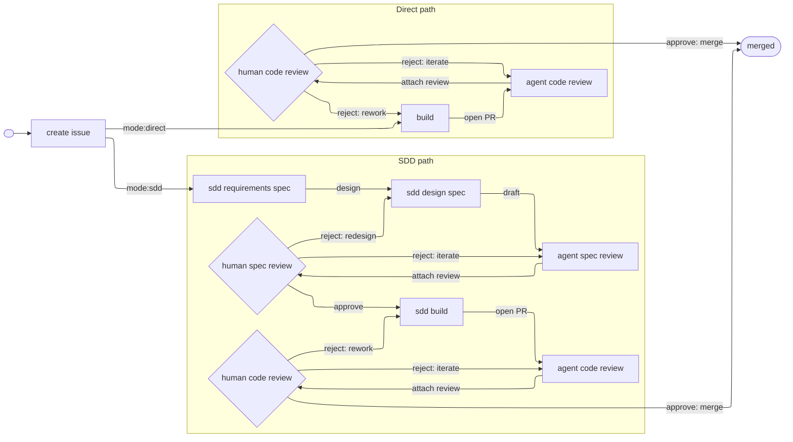

# Workflow

Standard workflow for how ideas become merged PRs in a workspace repo.

# Main concepts that we need to flesh out in documentation somewhere in ~/workflow/ directory:
All pre-existing documentation, workflow standards, skills, tooling, etc. is open for modification, deletion, and addition. We are re-writing the workflow and are not bound by prior convention.

Workflow is based on a state machine using GH Issues. A workflow graph of nodes and edges is clearly defined in a central location.

GH Issue labels are defined in a central location and relayed to GH via [bootstrap-labels](~/workspace/dev-playbook/tools/bin/bootstrap-labels).

Human and agents collaborate to move issues along the graph from beginning to end, with a spectrum of permissions and authority to take actions and transitions. This is supported by well-organized and factored /skills and /tools scripts. Many /skills and /tools will need modification to fit the new workflow.

Since Claude Code "claude agents" view relies on worktrees, we need to understand how worktrees are created, entered, exited, and deleted. Our old workflow relied on manual worktree creation and cleanup; we now expect to use to "claude agents" native worktree tooling. Make sure to have agents check that local Git is up-to-date with remote Git before launching new adventures.

Current system security constraints require user yubikey tap for both `git pull` and `git push`. We are open to relaxing this requirement but will keep it in place tentatively while we develop the workflow.

Document and intentionally scope permissions granted to Claude Code agents.

Incorporate Claude Code's /goal feature; very useful to maximize agent autonomy.

Explore "sandboxing" methods (Claude Code native and third-party alternatives such as Pocock's sandcastle, etc.). Have not explored these at all yet. Not sure if they are useful.

All state transitions, actions, metadata, for each issue, is tracked in a local SQLite DB so we can understand how our system performs.

I'm interested in a lightweight web browser view of the system. Something visually appealing and parsimonious I can view in my browser. For example, a colorful view of the graph that indicates where all my open issues are and the states they are in. This would be a "live" view the same way Claude Code's "claude agents" view is live.

Will need a closed feedback loop to improve the workflow and skills over time. One idea: a skill to run at the of a workflow that looks back on the context, summarizes what went well, what went wrong, unexpected surprises, and lessons learned, then compresses and writes them to a database, with all associated metadata for the session. Another agent or workflow can watch at that higher level and guide workflow improvements over time.

The `/improve-codebase-architecture` skill seems very useful but was not integrated in the old workflow. Look for opportunities to integrate into new workflow.

# Graph-based flow

## State machine

Every issue is tagged with a tuple of labels: `(mode:*, phase/*)`. Both labels are always present. The state of an issue is the tuple. Each node below is one reachable `(mode, phase)` combination.

Each node also has two attributes: `(actor ∈ {agent, human}, role ∈ {work, review})`. Four kinds:

- `(agent, work)` — agent produces output (e.g., `sdd_build`, `build`)
- `(agent, review)` — agent reviews work, attaches findings (e.g., `sdd_agent_spec`, `agent_code`)
- `(human, work)` — human produces output (e.g., `create_issue`, `sdd_requirements`, `sdd_design`)
- `(human, review)` — human reads and decides (e.g., `sdd_human_spec`, `human_code`)



Some edges are not skill-fired: `start → create_issue` is `gh issue create`; the mode-branching edges out of `create_issue` are label changes; `reject: redesign` and `approve: merge` are `gh` label or PR changes.

One long-lived PR per issue, opened by the implementing skill on the `open PR` edge and merged on `approve: merge` via `gh pr merge`.

## Dispatch

The human dispatcher operates from Claude Code's "claude agents" dashboard (see [agent-view-adoption.md](~/workspace/dev-playbook/workflow/agent-view-adoption.md) for the view's capabilities and limits). Anthropic subscription billing requires interactive sessions, so every node entry is human-launched: the dispatcher types `/skill-name <args>` to spawn a new agent session that invokes the skill as its first action.

Only the human can set `/goal` — it's a UI command, not a skill, and agents cannot invoke it. Prefixing an invocation with `/goal <condition>` lets the dispatcher set a completion condition; the runtime then runs the session until an evaluator confirms the condition holds. A single `/goal` session can chain multiple skill invocations.

All FOTW skills are launched under `/goal`; HITL skills never are. FOTW skills declare a terminal `DONE: …` line so the (text-only) evaluator can match deterministically. Pair action with proof and a stop-clause: `/goal Run /<skill> <args> until <DONE: line appears>, or stop after N turns.`

## Permissions

Tool access is governed by a tiered settings hierarchy. Rules at every level merge into one effective ruleset; **deny wins anywhere** — a deny at any level blocks the call regardless of allows elsewhere.

| Level (highest precedence first) | File / Source | Our use |
|---|---|---|
| Managed | `/etc/claude-code/managed-settings.json` | Not used (not enterprise). |
| CLI args | `claude agents --permission-mode dontAsk …` | **Sets FOTW mode for dispatched sessions only**, leaving personal `claude` sessions in their normal mode. |
| Local | `<repo>/.claude/settings.local.json` | Rare; gitignored personal exceptions. |
| Project | `<repo>/.claude/settings.json` | Repo-specific allow rules. |
| User | `~/.claude/settings.json` | Cross-cutting allow rules and `Skill()` gates. Stow-linked from `dotfiles/dot-claude/`. Benign for personal sessions — never sets mode. |

At runtime, the active skill's `allowed-tools` front-matter adds to the effective allow set for the skill's lifetime — this is the **per-skill permission set** referenced in the [skill table](#skills). Additive only; cannot override a deny.

**Mode: `dontAsk`, set at agent-view startup** via `claude agents --permission-mode dontAsk`. Auto-deny anything not pre-approved; never prompt. Applies to FOTW dispatches only. Trades upfront allow-list enumeration for runtime determinism — no surprise prompts during FOTW sessions.

User-level allow rules cover cross-cutting tools (`Skill()` for our FOTW skills, `Bash(gh *)`, common filesystem commands) and are safe in personal sessions. Per-skill `allowed-tools` covers skill-internal needs only. Canonical rule syntax and edge cases: [permissions docs](https://code.claude.com/docs/en/permissions).

## Skills

Three modes of human engagement exist in theory; only two are available under the [Dispatch](#dispatch) model:

- **Human in the loop (HITL)** — human is actively engaged throughout, spending real time and focus. Use this for stages that focus on extracting human intent. Examples: initial issue creation and writing specs.
- **Finger on the wheel (FOTW)** — skill is designed to run hands-off; human is present only because billing requires it. Agent does the work; human invokes the skill and responds to escalations. Examples: implementing code, performing agent reviews.
- **Hands off the wheel (AFK)** — agent runs autonomously, no human involvement. *Not available* — see [Dispatch](#dispatch). We would use this if we could.

FOTW agents can escalate to the human at any time — typically when they encounter something unexpected or want to deviate from their initial plan.

Direct-mode skills mirror SDD-mode skills by dropping the `sdd-` prefix (e.g., `/sdd-tdd` → `/tdd`).

| Node | Skill | Mode | Permissions set | Escalation triggers |
|------|-------|------|-----------------|---------------------|
| `create_issue` | `/intake` | HITL | TBD | TBD |
| `sdd_requirements` | `/sdd-requirements` | HITL | TBD | TBD |
| `sdd_design` | `/sdd-design` | HITL | TBD | TBD |
| `sdd_build` | `/sdd-tdd` | FOTW | TBD | TBD |
| `build` | `/tdd` *(new)* | FOTW | TBD | TBD |
| `sdd_agent_spec` | `/sdd-agent-spec-review` *(new)* | FOTW | TBD | TBD |
| `sdd_agent_code` | `/load-issue` → `/code-review --comment` | FOTW | TBD | TBD |
| `agent_code` | `/load-issue` → `/code-review --comment` | FOTW | TBD | TBD |

# Old, pre-existing sections that need new consideration. We may delete or modify these based on how they fit into the new standard.

## Issue body format (the brief is the body)

The issue body IS the agent brief. Use this format:

```markdown
**Summary:** one-line description

**Current behavior:**
What happens now (or status quo for an enhancement).

**Desired behavior:**
What should happen after the work is complete. Be specific about edge cases and error conditions.

**Key interfaces:**
- `TypeName` — what changes and why
- `functionName()` — what it returns vs what it should return
- Config shape — any new options needed

**Acceptance criteria:**
- [ ] Specific, testable criterion 1
- [ ] Specific, testable criterion 2

**Out of scope:**
- Things that should NOT be changed
- Adjacent features that are separate

**Blocked by:** #<issue-number> (or "None")
```

Brief principles, applied when writing or revising:

- **Durability over precision.** The issue may sit for days or weeks. Describe interfaces, types, and behavioural contracts. Do not reference file paths or line numbers — they go stale.
- **Behavioural, not procedural.** Describe what the system should do, not how to implement it. The agent will explore and decide.
- **Testable acceptance criteria.** Each criterion is independently verifiable.
- **Explicit out-of-scope.** Prevents gold-plating.

## Vertical-slice rules (when one idea becomes many issues)

Break a plan into **tracer bullet** issues. Each issue is a thin vertical slice cutting through ALL integration layers end-to-end, NOT a horizontal slice of one layer.

- Each slice delivers a narrow but COMPLETE path through every layer (schema, API, UI, tests).
- A completed slice is demoable or verifiable on its own.
- Prefer many thin slices over few thick ones.

Publish issues in dependency order so the `Blocked by` field can reference real issue numbers.