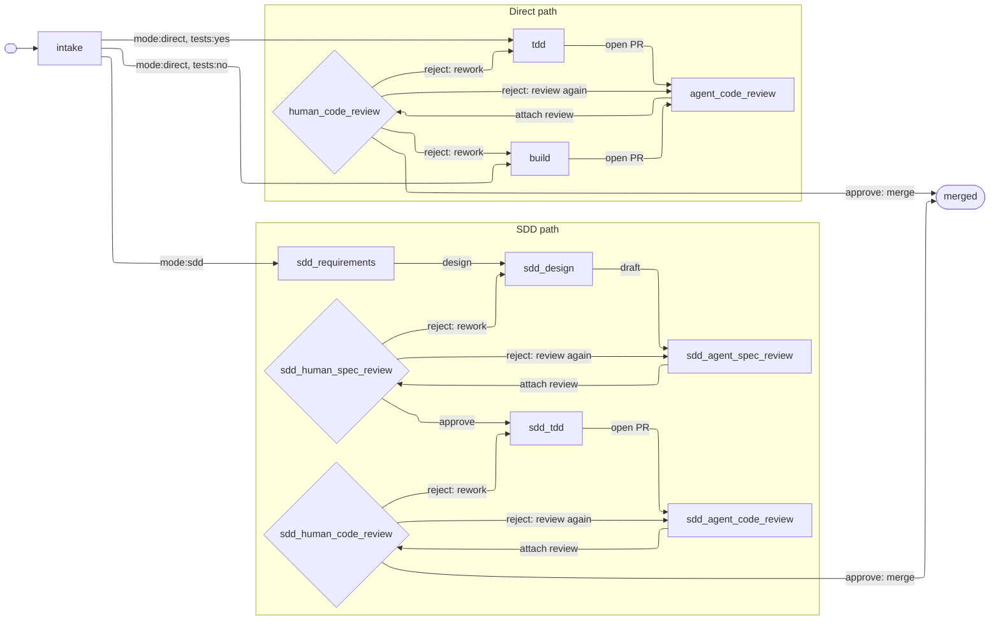

# Workflow

Standard workflow for how ideas become merged PRs in a workspace repo.

# Main Concepts That We Need to Flesh Out in Documentation Somewhere in ~/workflow/ Directory:
All pre-existing documentation, workflow standards, skills, tooling, etc. is open for modification, deletion, and addition. We are re-writing the workflow and are not bound by prior convention.

GH Issue labels are defined in a central location and relayed to GH via [bootstrap-labels](~/workspace/dev-playbook/tools/bin/bootstrap-labels). The label set must be refreshed for the new `(category:*, mode:*, tests:*, phase:*)` scheme.

Human and agents collaborate to move issues along the graph from beginning to end, with a spectrum of permissions and authority to take actions and transitions. This is supported by well-organized and factored /skills and /tools scripts. Many /skills and /tools will need modification to fit the new workflow.

Since Claude Code "claude agents" view relies on worktrees, we need to understand how worktrees are created, entered, exited, and deleted. Our old workflow relied on manual worktree creation and cleanup; we now expect to use to "claude agents" native worktree tooling. Make sure to have agents check that local Git is up-to-date with remote Git before launching new adventures.

Current system security constraints require user yubikey tap for both `git pull` and `git push`. We are open to relaxing this requirement but will keep it in place tentatively while we develop the workflow.

All state transitions, actions, metadata, for each issue, is tracked in a local SQLite DB so we can understand how our system performs.

Interested in a lightweight web browser view of the system. Something visually appealing and parsimonious I can view in my browser. For example, a colorful view of the graph that indicates where all my open issues are across entire GH account, and the states they are in. This would be a "live" view the same way Claude Code's "claude agents" view is live.

Will need a closed feedback loop to improve the workflow and skills over time. One idea: a skill to run at the of a workflow that looks back on the context, summarizes what went well, what went wrong, unexpected surprises, and lessons learned, then compresses and writes them to a database, with all associated metadata for the session. Another agent or workflow can watch at that higher level and guide workflow improvements over time.

`/improve-codebase-architecture` is a dedicated refactor stage — whole-codebase module deepening that mutates code and tests. It is its own concern, not part of the spec-authoring phases; whether the graph grows a standalone refactor node is deferred, out of scope for this pass.

Plan a pass over all skills to align with this workflow: update existing skills, author the ones referenced here but not yet on disk (`/tdd`, `/build`, `/sdd-agent-spec-review`, `/sdd-agent-code-review`, `/agent-code-review`), retire obsolete ones (`/sdd` dispatcher).

# Graph-based Flow

## State machine

Every issue is tagged with a four-tuple of labels: `(category:*, mode:*, tests:*, phase:*)`. All four are always present. The state of an issue is the `(mode, tests, phase)` sub-triple — each node below is one reachable combination. Category is required metadata but does not affect routing.

- `category:*` — `category:bug` (broken or incorrect) or `category:enhancement` (new behavior or improvement; covers everything that isn't a bug, including docs, config, refactors, and chores). Picked at intake.
- `mode:*` — `mode:sdd` or `mode:direct`. Picked at intake.
- `tests:*` — `tests:yes` or `tests:no`. Picked at intake. `mode:sdd` always carries `tests:yes`; `mode:direct` is split — testable work goes `tests:yes` (routed to `tdd`), doc/config/work not touching tests goes `tests:no` (routed to `build`).
- `phase:*` — the current node in the graph below. The graph is the inventory; see [Naming](#naming).

### Valid labels

[bootstrap-labels](~/workspace/dev-playbook/tools/bin/bootstrap-labels) mints exactly these. Six fixed-value labels enumerated below, plus all `phase:*` labels derived from graph nodes per [Naming](#naming).

| Dimension | Label | Meaning |
|---|---|---|
| Category | `category:bug` | Something is broken or incorrect. |
| Category | `category:enhancement` | New behavior or improvement; covers everything that isn't a bug. |
| Mode | `mode:sdd` | SDD path: spec → design → TDD ceremony. |
| Mode | `mode:direct` | Direct path: no spec/design ceremony. |
| Tests | `tests:yes` | Issue involves writing or modifying tests. |
| Tests | `tests:no` | Issue does not touch tests. |

### Node attributes

Each node also has two attributes: `(actor ∈ {agent, human}, role ∈ {work, review})`. Four kinds:

- `(agent, work)` — agent produces output (e.g., `sdd_tdd`, `tdd`, `build`)
- `(agent, review)` — agent reviews work, attaches findings (e.g., `sdd_agent_spec_review`, `agent_code_review`)
- `(human, work)` — human produces output (e.g., `intake`, `sdd_requirements`, `sdd_design`)
- `(human, review)` — human reads and decides (e.g., `sdd_human_spec_review`, `human_code_review`)



### Naming

Phase labels and slash-commands derive from graph node ids by `_`→`-`. Example: node `sdd_agent_spec_review` → label `phase:sdd-agent-spec-review`, command `/sdd-agent-spec-review`. The set of graph nodes IS the phase-label inventory.

Each work or agent-review node's skill updates the issue's `phase:*` label to the next node when it finishes. The three human-review nodes share one skill, `/human-review`: it reads the `phase:*` label to place itself, lays out the prior agent review and the artifact, and executes the human's verdict — advancing on approve (merging the PR at a code node), or routing the label back to an earlier node on `reject` (`review again`, `rework`). This is the one command whose name does not derive from a node id: it serves `sdd_human_spec_review`, `sdd_human_code_review`, and `human_code_review` at once. The human launches every node (per [Dispatch](#dispatch)) — nothing launches itself.

One long-lived PR per issue, opened by the implementing skill on the `open PR` edge and merged on `approve: merge` via `gh pr merge`.

## Dispatch

The human dispatcher operates from Claude Code's "claude agents" dashboard (see [agent-view-adoption.md](~/workspace/dev-playbook/workflow/agent-view-adoption.md) for the view's capabilities and limits). Anthropic subscription billing requires interactive sessions, so every node entry is human-launched.

**One session, one node — nodes do not auto-advance.** A node skill does its work, commits, and updates the issue's `phase:*` label to the next node's label, then stops and returns control to the dashboard. It never launches the next node, and never begins the next node's work in the same session. The human reads the issue's new phase and launches the matching skill. Every transition stays human-gated and visible on the live dashboard.

The two modes invoke differently. **FOTW skills run hands-off under `/goal`**, which pairs the action with proof and a stop-clause: `/goal Run /<skill> <args> until <DONE: line appears>, or stop after N turns.` So every FOTW skill closes by emitting a deterministic `DONE: …` line the (text-only) evaluator can match. **HITL skills are launched directly as `/<skill> <args>`** with the human engaged throughout; they close with a plain report to the human and need no `/goal` wrapper or `DONE:` line.

## Permissions

Tool access is governed by a tiered settings hierarchy. Rules at every level merge into one effective ruleset; **deny wins anywhere** — a deny at any level blocks the call regardless of allows elsewhere.

| Level (highest precedence first) | File / Source | Our use |
|---|---|---|
| Managed | `/etc/claude-code/managed-settings.json` | Not used (not enterprise). |
| CLI args | `claude agents --permission-mode dontAsk …` | **Sets FOTW mode for dispatched sessions only**, leaving personal `claude` sessions in their normal mode. |
| Local | `<repo>/.claude/settings.local.json` | Rare; gitignored personal exceptions. |
| Project | `<repo>/.claude/settings.json` | Repo-specific allow rules. |
| User | `~/.claude/settings.json` | `Skill()` gates for FOTW-entry skills, plus narrow backstop for built-in skills. Stow-linked from `dotfiles/dot-claude/`. Benign for personal sessions — never sets mode. |

**Mode: `dontAsk`, set at agent-view startup** via `claude agents --permission-mode dontAsk`. Auto-deny anything not pre-approved; never prompt. Applies to every dispatched session (HITL and FOTW); personal `claude` sessions are unaffected. Trades upfront allow-list enumeration for runtime determinism.

Allow rules are encoded at two levels:

- **User-level allow** holds only `Skill(name)` gates for dispatcher-launched skills, plus a narrow bash backstop for built-in skills (e.g., `/code-review`'s `Bash(gh pr diff *)`).
- **Per-skill `allowed-tools` front-matter** holds everything else: bash, edits, sub-skills (`Skill(child)`). This is the **per-skill permission set** in the [skill table](#skills). Additive, scoped to the skill's lifetime; cannot override a deny.

**Bash baseline.**

- *Auto-allowed in every mode, no rule needed:* `ls`, `cat`, `echo`, `pwd`, `head`, `tail`, `grep`, `find`, `wc`, `which`, `diff`, `stat`, `du`, `cd`, read-only `git` forms.
- *User-level allow for universally-trusted mutators:* `Bash(mkdir *)`, `Bash(touch *)`, `Bash(mv *)`, `Bash(cp *)`.
- *`rm` is not yet user-allowed.* Worktree auto-isolation cwd-bounds each session — sufficient practical confinement (soft boundary, not an OS jail). Code-writing skills will likely need `rm`; not yet committed.

A transition a skill performs — the `phase:*` label update, plus any commit or PR action — is covered by that skill's `allowed-tools`. Transitions the human performs (label changes, manual merge) need no encoding.

Canonical rule syntax and edge cases: [permissions docs](https://code.claude.com/docs/en/permissions).

## Skills

Three modes of human engagement exist in theory; only two are available under the [Dispatch](#dispatch) model:

- **Human in the loop (HITL)** — human is actively engaged throughout, spending real time and focus. Use this for stages that focus on extracting human intent. Examples: initial issue creation and writing specs.
- **Finger on the wheel (FOTW)** — skill is designed to run hands-off; human is present only because billing requires it. Agent does the work; human invokes the skill and responds to escalations. Examples: implementing code, performing agent reviews.
- **Hands off the wheel (AFK)** — agent runs autonomously, no human involvement. *Not available* — see [Dispatch](#dispatch). We would use this if we could.

Direct-path work splits by `tests:*`. `/tdd` mirrors `/sdd-tdd` for testable Direct work; `/build` handles non-test work — docs, config, chores. Both feed shared `agent_code_review` and `human_code_review`.

### Node-skill contract

Across modes, a node skill copies its `allowed-tools` verbatim from the [table](#skills) below. When it has required reading, it front-loads a `## Read first` section ending in a `READ: <files>` confirmation; when it has none, it omits the section entirely. Mode fixes the rest — see [Dispatch](#dispatch) for the launch and termination mechanics. This contract fixes structure; the authoring *style* behind the skills — voice, content, robustness, mechanics — lives in [skill-authoring.md](~/workspace/dev-playbook/workflow/skill-authoring.md).

- **HITL** — the human is engaged throughout, so the body may gate on interviews and approvals, and the skill terminates with a plain report. Escalation is `—`: the human is already present.
- **FOTW** — the skill runs hands-off, so it terminates with the deterministic `DONE:` line and declares its escalation triggers in the table, escalating whenever it meets something unexpected or wants to deviate from its plan.

| Skill | Mode | Permissions set (`allowed-tools`) | Escalation triggers |
|-------|------|-----------------------------------|---------------------|
| `/intake` | HITL | `Bash(gh issue *)` `Bash(gh label *)` `Skill(grill-with-docs)` | — |
| `/sdd-requirements` | HITL | `Bash(gh issue *)` `Edit` `Write` `Skill(grill-with-docs)` `Skill(commit)` | — |
| `/sdd-design` | HITL | `Bash(gh issue *)` `Edit` `Write` `Skill(grill-with-docs)` `Skill(commit)` | — |
| `/sdd-tdd` | FOTW | `Bash(gh issue *)` `Bash(gh pr *)` `Bash(git *)` `Edit` `Write` `Skill(commit)` | Interface amendment / spec gap; blocking ambiguity; test red after 2 attempts |
| `/tdd` | FOTW | same as `/sdd-tdd` | TBD |
| `/build` | FOTW | same as `/sdd-tdd` | TBD |
| `/sdd-agent-spec-review` | FOTW | `Bash(gh issue view *)` `Bash(gh issue comment *)` `Bash(gh issue edit *)` `Bash(make *)` | Consistency gate red (malformed spec); specs absent/unreadable |
| `/sdd-agent-code-review` | FOTW | `Bash(gh issue view *)` `Bash(gh issue edit *)` `Bash(gh pr view *)` `Bash(gh pr diff *)` `Bash(gh pr comment *)` `Bash(make *)` | Green gate red (PR over red tree); PR/diff missing |
| `/agent-code-review` | FOTW | `Skill(load-issue)` `Skill(code-review)` | TBD |
| `/human-review` | HITL | `Bash(gh issue view *)` `Bash(gh issue edit *)` `Bash(gh issue comment *)` `Bash(gh pr view *)` `Bash(gh pr diff *)` `Bash(gh pr merge *)` | — |

**Compound dispatch — the code-review nodes.** `sdd_agent_code_review` and `agent_code_review` each run two passes in one FOTW goal: the native `/code-review` (an automated bug/regression review that posts its findings as a PR comment) followed by our skill (the spec-fidelity and convention findings the native pass does not cover, also a PR comment). Ours runs last so its label advance means both reviews are done, and so it can read the native comment and skip re-flagging. The goal chains them:

```
/goal Run /load-issue <issue>, then /code-review <pr>, then /sdd-agent-code-review <issue> — stop once all have run, or after N turns.
```

