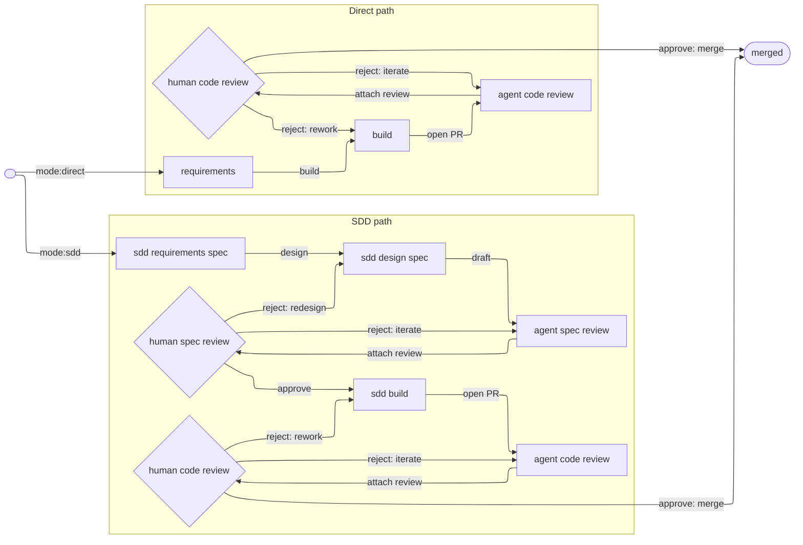

# Workflow

Standard workflow for how ideas become merged PRs in a workspace repo.

# Main concepts that we need to flesh out in documentation somewhere in ~/workflow/ directory:
All pre-existing documentation, workflow standards, skills, tooling, etc. is open for modification, deletion, and addition. We are re-writing the workflow and are not bound by prior convention.

Workflow is based on a state machine using GH Issues. A workflow graph of nodes and edges is clearly defined in a central location.

GH Issue labels are defined in a central location and relayed to GH via [bootstrap-labels](~/workspace/dev-playbook/tools/bin/bootstrap-labels).

Human and agents collaborate to move issues along the graph from beginning to end, with a spectrum of permissions and authority to take actions and transitions. This is supported by well-organized and factored /skills and /tools scripts. Many /skills and /tools will need modification to fit the new workflow.

Aim for maximum "finger on the wheel" agentic development using Claude Code's "claude agents" view. Fully "hands off the wheel" AFK development is out of scope since we rely on "interactive" Claude Code sessions using "claude agents" view (documented in [agent-view-adoption.md](~/workspace/dev-playbook/workflow/agent-view-adoption.md)).

Since Claude Code "claude agents" view relies on worktrees, we need to understand how worktrees are created, entered, exited, and deleted. Our old workflow relied on manual worktree creation and cleanup; we now expect to use to "claude agents" native worktree tooling.

Current system security constraints require user yubikey tap for both `git pull` and `git push`. We are open to relaxing this requirement but will keep it in place tentatively while we develop the workflow.

Document and intentionally scope permissions granted to Claude Code agents.

Incorporate Claude Code's /goal feature; very useful to maximize agent autonomy.

Explore "sandboxing" methods (Claude Code native and third-party alternatives such as Pocock's sandcastle, etc.). Have not explored these at all yet. Not sure if they are useful.

All state transitions, actions, metadata, for each issue, is tracked in a local SQLite DB so we can understand how our system performs.

I'm interested in a lightweight web browser view of the system. Something visually appealing and parsimonious I can view in my browser. For example, a colorful view of the graph that indicates where all my open issues are and the states they are in. This would be a "live" view the same way Claude Code's "claude agents" view is live.

The `/improve-codebase-architecture` skill seems very useful but was not integrated in the old workflow. Look for opportunities to integrate into new workflow.

# State machine graph

Every issue is tagged with a tuple of labels: `(mode:*, phase/*)`. Both labels are always present. The state of an issue is the tuple. Each node below is one reachable `(mode, phase)` combination.

Each node also has two attributes: `(actor ∈ {agent, human}, role ∈ {work, review})`. Four kinds:

- `(agent, work)` — agent produces output (e.g., `sdd_build`, `build`)
- `(agent, review)` — agent reviews work, attaches findings (e.g., `sdd_agent_spec`, `agent_code`)
- `(human, work)` — human produces output (e.g., `sdd_requirements`, `sdd_design`, `requirements`)
- `(human, review)` — human reads and decides (e.g., `sdd_human_spec`, `human_code`)



Everything is human-invoked via "claude agents" view — subscription billing requires use of Claude Code interactive mode. Three modes of human engagement exist in theory; only two comply with the interactive mode constraint:

- **Human in the loop (HITL)** — human is actively engaged throughout, spending real time and focus. Use this for stages that focus on extracting human intent. Examples: initial issue creation and writing specs.
- **Finger on the wheel (FOTW)** — skill is designed to run hands-off; human is present only because billing requires it. Agent does the work; human invokes the skill and responds to escalations. Examples: implementing code, performing agent reviews.
- **Hands off the wheel (AFK)** — agent runs autonomously, no human involvement. *Not available* under subscription billing. We would use this if we could.

FOTW agents can escalate to the human at any time — typically when they encounter something unexpected or want to deviate from their initial plan.

## Skills

Placeholder — skill names and scope are still in flux. Each skill will have one row.

| Skill | Description | Mode | Permissions set | Escalation triggers |
|-------|-------------|------|-----------------|---------------------|
| _TBD_ | _One sentence._ | HITL or FOTW | _Permissions granted to the skill (e.g. `acceptEdits`, allowed tools, denied tools)._ | _Conditions under which the agent escalates to the human (e.g. unexpected state, plan deviation)._ |

Other edges are not skill-fired: issue creation (start edges) is `gh issue create` with the mode label; `reject: redesign` and `approve: merge` are `gh` label or PR changes.

One long-lived PR per issue, opened by the implementing skill on the `open PR` edge and merged on `approve: merge` via `gh pr merge`.

# Old, pre-existing sections that need new consideration. We may delete or modify these based on how they fit into the new standard.

## Issue body format (the brief is the body)

The issue body IS the agent brief. Use this format:

```markdown
**Summary:** one-line description

**Current behavior:**
What happens now (or status quo for an enhancement).

**Desired behavior:**
What should happen after the work is complete. Be specific about edge cases and error conditions.

**Key interfaces:**
- `TypeName` — what changes and why
- `functionName()` — what it returns vs what it should return
- Config shape — any new options needed

**Acceptance criteria:**
- [ ] Specific, testable criterion 1
- [ ] Specific, testable criterion 2

**Out of scope:**
- Things that should NOT be changed
- Adjacent features that are separate

**Blocked by:** #<issue-number> (or "None")
```

Brief principles, applied when writing or revising:

- **Durability over precision.** The issue may sit for days or weeks. Describe interfaces, types, and behavioural contracts. Do not reference file paths or line numbers — they go stale.
- **Behavioural, not procedural.** Describe what the system should do, not how to implement it. The agent will explore and decide.
- **Testable acceptance criteria.** Each criterion is independently verifiable.
- **Explicit out-of-scope.** Prevents gold-plating.

## Vertical-slice rules (when one idea becomes many issues)

Break a plan into **tracer bullet** issues. Each issue is a thin vertical slice cutting through ALL integration layers end-to-end, NOT a horizontal slice of one layer.

- Each slice delivers a narrow but COMPLETE path through every layer (schema, API, UI, tests).
- A completed slice is demoable or verifiable on its own.
- Prefer many thin slices over few thick ones.

Publish issues in dependency order so the `Blocked by` field can reference real issue numbers.