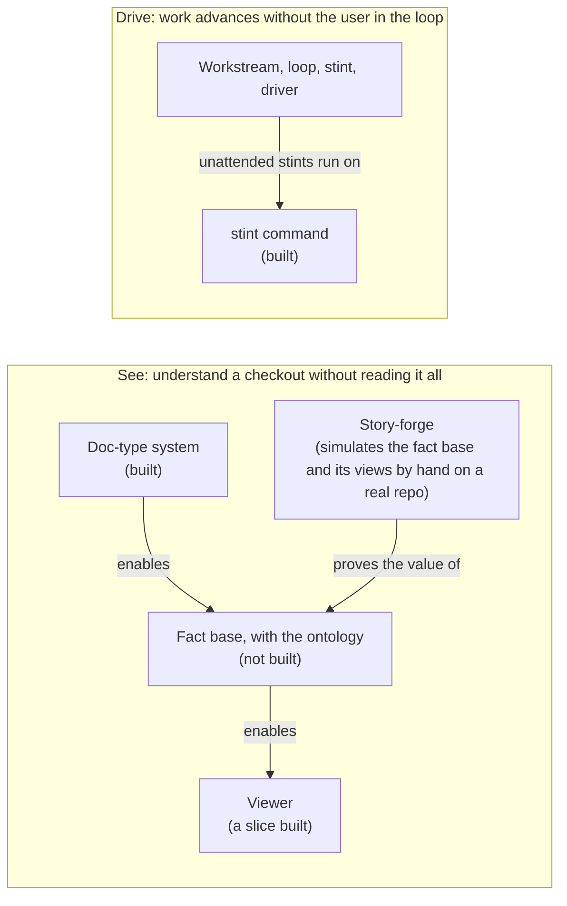

# System Workstream

This workstream is speculative. The workstream holds the user's
one aim for the systems of `~/workspace`, split in two child
workstreams, and this head file holds only what crosses them.

## Goal

The user sees and steers the workspace's systems without reading them,
and work on them advances without the user always in the loop. The
reason is [System Legibility](/docs/system-legibility.md). Two child
workstreams carry the goal:

- **See**: deterministic code shows what a checkout does, at the CLOA.
  Head file: [See Workstream](/workstreams/system/see/WORKSTREAM.md).
- **Drive**: work advances in stints, most of them unattended, and the
  user gives verdicts. Head file:
  [Drive Workstream](/workstreams/system/drive/WORKSTREAM.md).

Two parts are built and closed, and each lives in the main part of
the repo, outside `workstreams/`:

- **The doc-type system**, part of See: five doc-types, Runbook,
  Standard, Guide, Loop, and Workstream, under
  [`doc-types/`](/doc-types/index.md), drawn whole in
  [Reference Model](/doc-types/reference-model.md) and held to the
  Standard [Doc-Type](/standards/doc-type/doc-type.md).
- **The `stint` command**, a tool Drive uses: it runs one unattended
  stint in sealed Sandcastle containers, from launch to its end
  ([Running a Stint](/guides/running-a-stint.md)).

The two meet at one seam: a loop's verification reads the facts that
See extracts.

## Done when

None: the goal is standing.

## Principles

- **Markdown is code.** Just a fuzzy, random form of it, with the LLM
  as the stochastic compiler. The doc-types give markdown files
  structure, contracts, APIs, and typing. CLOA is about embedding
  deterministic structure within them.
- **The picture and the predicates, both.** The user naturally thinks
  in the literal picture, the reference model. The predicates let us
  generalize beyond specific examples into a general description of
  the whole. A reference model shows one point in the distribution;
  the predicates describe the distribution.
- **Describe structure, not steps.** Not what an agent should do, but
  the structure the user wants enforced. That kind of specification is
  durable: it sticks around when the conversation is over, and it is
  how the user gets hands off the wheel.
- **A big fuzzy target can't be looped.** When the goal is large,
  unspecified, and high dimensional, invoking the magic phrase "loop"
  is not enough; the loop needs a well-defined target and a hope of
  reaching it without the user.

## Terms

The terms, such as predicate, fact base, workstream, and stint, are in
[CONTEXT.md](/CONTEXT.md).

## Planned

- **Reconsider System Legibility from scratch.** After See and Drive
  are refactored,
  [System Legibility](/docs/system-legibility.md), the oldest document
  of this work, is read again against them, and each of its ideas is
  kept, rewritten, or dropped.
  - **Absorb Working in Loops.**
    [Working in Loops](/workstreams/system/working-in-loops.md) is old
    and outdated, but may hold good ideas. Its ideas are scrubbed into
    this workstream the same way, and the file is then deleted.

## Acronyms

- **CLOA** — Correct Level of Abstraction.
- **LLM** — Large Language Model.
