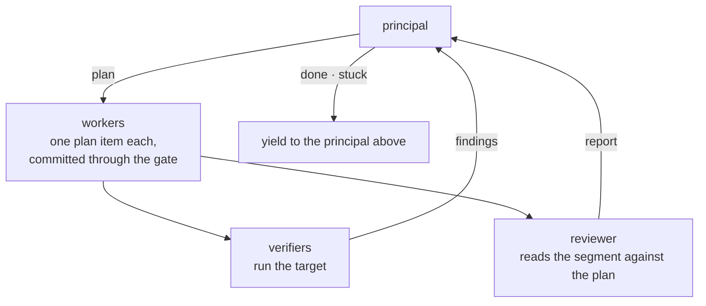

# Stint Model

The model of one unattended stint, from its target to its yield, as
decided with the user on 2026-09-25 in the session "Think the system
through". It is a guess, per
[Drive Workstream](/workstreams/system/drive/WORKSTREAM.md), and the
`stint` command does not do all of it yet; the changes are in that
head file's Planned list.

## Diagram

One pattern, the supervised loop, used at three levels. One pass of
the loop is a segment and its checkpoint:

The levels:

| Level | Principal | Target | Plan · log | Worker | Verifiers |
|---|---|---|---|---|---|
| Workstream | the user | its draft Standard(s) | `## Stints` | a stint | `check` · a judge |
| Stint | the top-level agent | the rules it targets | `PLAN.md` · `PROGRESS.md` | an iteration | `check` · a judge |
| Iteration | none | one task | none | none | may run `check` as a signal |

## Settled

- **One pattern, three levels, four roles.** A workstream, a stint,
  and an iteration are each the supervised loop of the diagram, at
  different scales. Each level has a
  [principal](/CONTEXT.md#governance) that owns the plan, workers
  that do its items, verifiers that run the target and return findings,
  and a reviewer. The iteration is the base case: one task and no
  loop. The pattern is shared in names only. The code runs the stint
  level, and a generic loop that nests is not built.
- **The principal decides; the verifiers and the reviewer report.**
  A [verifier](/CONTEXT.md#governance) runs rules and returns
  findings: `check` the deterministic rules, a judge the stochastic
  ones, as a classifier, one bool per rule per member. The
  reviewer reads the segment against the plan and returns a sorted
  report, so that the principal's context holds the report and not
  the diff. They report as peers, and none sees another's output, so
  every report reaches the principal unfiltered.
- **A workstream's target is one or more draft Standards.** A
  [draft Standard](/CONTEXT.md#governance) is a
  file typed `Standard` in the workstream, held to the Standards about
  Standards. `## Done when` points at them. It differs from any other
  Standard only in its place and its wiring, and wiring is never the
  Standard's, so it is a plain `Standard` and not a doc-type of its own.
- **Wiring makes a Standard an invariant or a target.** A Standard
  under `standards/` is wired to the pre-commit gate: it is the
  invariant, and its deterministic rules must hold on every commit. A
  draft Standard is wired to `--check` only: it is the target, its
  rules may fail at any time, and a failure is a signal toward the
  target, never a block.
- **On accept, each draft Standard is deleted or promoted.** A
  promoted one moves under `standards/` and is wired to the gate, so
  it moves from target to invariant.
- **A rule id is `<workstream>.<slug>`**, such as
  `view-rename.no-kind-word`, the name of the workstream that holds it,
  and no two rules of one workstream's draft Standards share a slug.
- **A loop advances a leaf workstream only.** A workstream with
  children is never a stint's target, so every rule id names a leaf.
- **`check` sits beside the head file.** It runs the deterministic
  rules of the workstream's draft Standards, `check <rule-id>…`, prints one finding per failed
  member, and is what the stint's `--check` runs. It lives as long as
  the workstream does.
- **The user and an attended agent write the target before launch**:
  the draft Standards, `check`, and the stint's entry.
- **A stint advances part of a workstream.** Its planned entry under
  `## Stints` names its loop and the rule ids it targets. Rules outside
  that list are not checked.
- **`PLAN.md` and `PROGRESS.md` are one stint's breakdown**, on its
  branch: the tasks, in segments, that one iteration each does. They
  are a level below the head file's worklist.
- **The pre-commit gate holds the permanent Standards** on every
  iteration's commit. An iteration has to pass the gate and nothing
  more.
- **An iteration may run `check` at any time.** Its output is a signal
  of direction, and no call stops on it. The driver's run at the
  checkpoint is the one that counts.
- **Findings usually go down over a stint, but not always.** They are
  optional and helpful backpressure.
- **Done needs zero findings.** The driver refuses the principal's
  done while the verifiers report any finding over the rules the stint
  targets. A principal that finds the target out of reach yields
  stuck instead.
- **Authority goes down only.** The user sets the principal's target; the
  principal sets the iterations' tasks. The principal may revise
  `PLAN.md`, and never the draft Standards, `check`, or the stint's entry. A
  rule the principal finds wrong ends the stint as stuck, and the user rules
  on it.
- **A worker that fails its task yields stuck.** This is one event at
  every level. A blocked iteration commits what it did, logs a
  deviation and its reason in `PROGRESS.md`, and exits; the stint
  continues, and the principal handles the deviation at the
  checkpoint. A stuck stint yields to the user the same way. Only a
  principal stops its own level.
